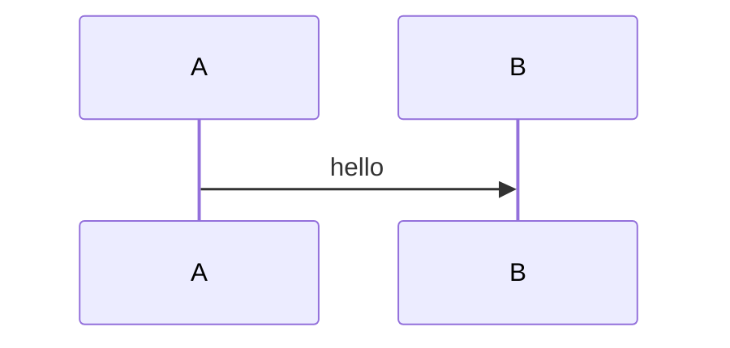

# RenderKit Alpha 0.0.2 技术方案

状态：下一阶段方案  
目标：把当前验证原型升级成可日常使用的本地 Agent artifact 工具。

---

## 1. 当前结论

当前原型已验证核心闭环可行：

```text
Agent 写 .rk.md
→ CLI validate/push
→ Server 返回 URL
→ 本地浏览器打开页面
→ 人在 Web 上评论
→ CLI feedback 返回评论 + sourceRange
→ Agent 修改 .rk.md 再 push
```

下一阶段不是继续堆 demo，而是把它整理成一个可维护、可发布、可扩展的工具。

---

## 2. Alpha 0.0.2 目标

Alpha 0.0.2 要做到：

1. CLI 变成真正的 `bin` 工具。
2. Server 能通过 CLI 一键启动或连接已有服务。
3. `.rk.md` DSL 稳定，错误提示可被 Agent 修复。
4. Web 页面视觉质量明显提升，不再是临时 CSS。
5. block 组件体系具备扩展能力。
6. 评论 / feedback / revision 闭环稳定。
7. 项目结构从原型整理为轻量 monorepo。

---

## 3. 使用方式目标

### 3.1 本地第一次使用

```bash
npm install -g renderkit
# 或 pnpm add -g renderkit

renderkit server start
renderkit push plan.rk.md --open
```

### 3.2 Agent 使用

```bash
renderkit validate plan.rk.md --json
renderkit push plan.rk.md --open --json
renderkit status plan.rk.md --json
renderkit feedback plan.rk.md --json
```

### 3.3 Server 返回 URL

`push` 后服务端返回：

```json
{
  "ok": true,
  "artifactId": "art_xxx",
  "revision": 3,
  "url": "http://localhost:3737/a/art_xxx?rev=3"
}
```

CLI 收到 URL 后：

```text
--open → 调用系统 open → 浏览器打开
```

---

## 4. 技术栈决策

### 4.1 Runtime / Package

推荐：**Node.js + npm bin**。

原因：

- Agent 环境最通用。
- npm/pnpm 全局安装最自然。
- Next.js 本身依赖 Node。
- Bun 可以作为开发加速，但不作为用户运行时要求。

不推荐强依赖 Bun：

- 用户机器未必有 Bun。
- Next.js + Bun 运行路径仍不如 Node 稳。
- CLI 发布到 npm 时 Node bin 是标准路径。

### 4.2 CLI

推荐：

- TypeScript
- `commander` 或 `cac`
- `tsx` 开发运行
- `tsup` 打包成单文件 ESM/CJS bin
- bin 名称：`renderkit`

CLI package 输出：

```json
{
  "bin": {
    "renderkit": "dist/cli.js"
  }
}
```

### 4.3 Server

推荐：**Next.js App Router**。

原因：

- 页面 + API 一体。
- React block renderer 直接复用。
- 本地 dev 体验好。
- 后续自托管也简单：`next build && next start`。

Alpha 阶段不追求最轻 runtime。

### 4.4 DSL parser

推荐：

- `unified`
- `remark-parse`
- `remark-directive`
- `remark-frontmatter`
- `remark-gfm`
- `js-yaml`
- `zod`

原则：不自研 parser。

### 4.5 Storage

Alpha 0.0.2：继续文件系统，但整理结构。

```text
.renderkit-data/
├── artifacts/
│   └── art_xxx/
│       ├── artifact.json
│       ├── revisions/
│       │   ├── 1.json
│       │   └── 2.json
│       └── comments.json
└── index.json
```

暂不上 SQLite。原因：文件系统方便观察和调试。

### 4.6 UI / Design System

当前 CSS 是临时的。Alpha 0.0.2 应引入设计 token。

推荐：

- CSS Variables 作为 token 层
- Tailwind 作为布局/utility 层
- Radix UI primitives 可选，用于 Popover/Dialog/Tabs/Tooltip
- 不引入大型 UI 框架作为主样式来源

设计资产参考：

- `html-anything` 的 surface / skill / example 视觉思路
- `open-design` 的 design-system / skills 思路
- Markdoc/MyST 的 directive 思路
- Portable Text 的 block model 思路

---

## 5. 项目结构

Alpha 0.0.2 推荐轻量 monorepo：

```text
RenderKit/
├── apps/
│   └── web/                 # Next.js server + UI
├── packages/
│   ├── cli/                 # renderkit bin
│   ├── dsl/                 # parser + compiler + validate
│   ├── blocks/              # block React components
│   ├── design/              # tokens + themes + block styles
│   └── shared/              # types + API contracts
├── examples/
│   └── plan.rk.md
├── docs/
└── package.json
```

当前原型可以逐步迁移，不需要一次重写。

---

## 6. CLI 命令规划

### 6.1 必须有

```bash
renderkit validate <file>
renderkit push <file> [--open]
renderkit status <file|artifactId>
renderkit feedback <file|artifactId>
renderkit server start
renderkit server status
```

### 6.2 暂不做

```bash
renderkit comment
renderkit edit
renderkit patch
renderkit deploy
```

评论只在 Web 页面产生。

---

## 7. Server 行为

Server 职责：

1. 接收 `.rk.md` source。
2. parse + validate。
3. 保存 artifact/revision/comment。
4. 渲染 URL 页面。
5. 提供 feedback API。

Push 流程：

```text
CLI validate 本地
→ POST source 到 Server
→ Server 再 validate
→ 保存 revision
→ 返回 URL
→ CLI open URL
```

本地 validate 是为了 Agent 快速修错。Server validate 是最终防线。

---

## 8. Design Token 方案

### 8.1 token 层

```css
:root {
  --rk-bg: ...;
  --rk-surface: ...;
  --rk-text: ...;
  --rk-muted: ...;
  --rk-accent: ...;
  --rk-border: ...;
  --rk-radius-card: ...;
  --rk-shadow-card: ...;
  --rk-font-sans: ...;
  --rk-font-mono: ...;
}
```

### 8.2 theme 层

内置：

- `dark-pro`
- `paper-light`
- `amber-terminal`

### 8.3 block style 层

每个 block 只使用 token，不直接写死颜色。

```css
.rk-callout {
  background: var(--rk-surface);
  border-color: var(--rk-accent);
}
```

这样后续可从 html-anything / open-design 借鉴模板，不改 block 逻辑。

---

## 9. Block Catalog Alpha

Alpha 0.0.2 目标 block：

### 必须稳定

1. `heading`
2. `paragraph`
3. `callout`
4. `summary`
5. `decision-card`
6. `diagram` / Mermaid
7. `code`

### 可以补

8. `table`
9. `timeline`
10. `checklist`

### 后置

- D2
- PlantUML
- ECharts
- AntV
- infographic
- SVG
- tabs/columns/accordion

---

## 10. DSL Alpha 规则

### 10.1 Directive block

```md
:::callout{id="risk-token" tone="warning" title="Token 风险"}
内容
:::
```

### 10.2 YAML body block

```md
:::decision-card{id="auth-decision"}
question: 认证方式选择
chosen: JWT + Redis
status: approved

rationale:
  - 无状态
  - 水平扩展友好
:::
```

### 10.3 Code body block

````md
:::diagram{id="login-flow" engine="mermaid"}

:::
````

### 10.4 ID 规则

- directive block 必须有 `id`
- id 在 artifact 内唯一
- id 格式：`[a-zA-Z0-9_-]+`
- id 是评论锚点，Agent 修改内容时不得随意改 id

---

## 11. Feedback 方案

`feedback` 是 Agent 的改稿入口。

它不是评论功能。

它返回：

- comment id
- block id
- comment text
- sourceRange
- sourceExcerpt
- block snapshot
- current revision

Agent 根据这些信息改 `.rk.md`。

---

## 12. Alpha 0.0.2 验收

### CLI

- `renderkit validate` 能返回行号错误。
- `renderkit push --open` 能打开页面。
- `renderkit status` 能返回 artifact 状态。
- `renderkit feedback` 能返回评论定位。
- `renderkit server start` 能启动本地服务。

### Web

- 页面视觉比当前原型明显提升。
- block hover 有评论入口。
- 右侧评论栏可创建评论。
- Mermaid 正常渲染。
- 单 block 出错不白屏。

### DSL

- `.rk.md` 示例能被 Agent 稳定生成。
- 错误能定位到行号。
- 评论能定位回源文件。

---

## 13. 实施顺序

1. 整理 monorepo 结构。
2. 抽出 `packages/dsl`。
3. 抽出 `packages/cli`，做真实 bin。
4. 抽出 `packages/blocks`。
5. 增加 `packages/design` token/theme。
6. 重构 server 到 `apps/web`。
7. 完善 CLI server start/status。
8. 改善 Web UI。
9. 补 block：summary/code/table。
10. 回归完整闭环。

---

## 14. 不追求

Alpha 0.0.2 不追求：

- 架构完美
- 云部署
- 权限系统
- 多用户
- 完整图表生态
- 模板市场
- 插件系统

只追求：

> 本地 Agent artifact workflow 可日常使用。
