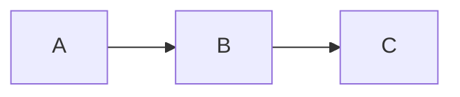
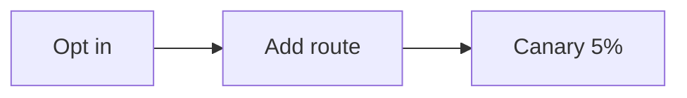

# RenderKit DSL Ergonomics Critique & 1.0 Proposal

**Status:** Review — no edits applied  
**Date:** 2026-05-17  
**Scope:** `packages/dsl/src/index.mjs`, `skills/renderkit-authoring/SKILL.md`, all examples

---

## 1. Current State Assessment

### 1.1 What works well

- **Remark-directive foundation.** Using `:::name{attrs}...:::` leverages standard Markdown extension tooling. Parser is clean, ~250 LOC, no magic.
- **Block-level review model.** Every directive block has stable `id`, `sourceRange`, `sourceExcerpt`. Comments anchor to blocks. This is the product's core value and it works.
- **Validation is strict and useful.** 13 error/warning codes with actionable messages. Unknown blocks fail fast. Required fields are enforced.
- **Surface recipes give structure guidance.** Agent knows what blocks belong in each surface. Anti-patterns documented.

### 1.2 Where the pain lives

After auditing all 12 `.rk.md` examples and the SKILL.md, the agent-authoring friction falls into five categories:

#### P1: Boilerplate per block is heavy

Every directive requires `:::type{id="..." ...}` opening and `:::` closing. For the most common blocks, this adds significant syntax overhead:

```md
:::summary{id="exec-summary" title="Executive Summary"}
Your text.
:::
```

vs. what an agent might prefer to write:

```md
##exec-summary Executive Summary
Your text.
```

The `id` is mandatory every time. On a typical engineering-plan with 8-12 directive blocks, the agent writes `:::typename{id="` 8-12 times plus 8-12 closing `:::` markers.

**Evidence:** `examples/surfaces/engineering-plan.rk.md` has 6 directive blocks, 42 lines of which ~30% are structural syntax. `examples/surfaces/review-report.rk.md` has 8 directive blocks with similar overhead.

#### P2: No shorthand for common patterns

Several block+attribute combinations repeat across documents:

| Pattern | Frequency across examples |
|---------|--------------------------|
| `callout{tone="warning"}` | 7 occurrences |
| `callout{tone="danger"}` | 5 occurrences |
| `callout{tone="info"}` | 4 occurrences |
| `summary{title="..."}` with short text | 8 occurrences |
| `decision-card` with question/chosen/rationale/alternatives YAML | 5 occurrences |
| `diagram{engine="mermaid"}` | 5 occurrences |
| `code{language="bash"}` | 4 occurrences |

None have aliases or shorthand.

#### P3: Diagram/chart authoring is verbose

To draw a simple flowchart:

````md
:::diagram{id="flow" engine="mermaid" caption="Process Flow"}

:::
````

This is 6 lines for a 1-line diagram. The `engine` attribute is redundant when the fenced code block already declares its language as `mermaid`. The nested fence-in-directive nesting requires fence-count escalation (```` ```mermaid inside :::diagram ````).

**Evidence:** Every single `diagram` example in the codebase uses an `engine` attribute that matches the fenced code language, making the attribute purely redundant.

#### P4: decision-card YAML body is awkward inside Markdown

```md
:::decision-card{id="auth-choice"}
question: Which auth mechanism?
chosen: JWT + Redis
status: proposed

rationale:
  - Stateless
  - Horizontally scalable

alternatives:
  - name: Session
    reason: Stateful, hard to scale
:::
```

YAML inside a directive inside Markdown. Agents must get the indentation exactly right. Missing a space before `-` in rationale produces `RK_DECISION_YAML_INVALID`. The YAML is not validated until parse time.

**Evidence:** `compileDecision()` at `packages/dsl/src/index.mjs:106-120` does `yaml.load(body)` with catch-and-report. The `rawDirectiveBody()` function extracts body by stripping first and last line — fragile if extra whitespace exists.

#### P5: Grid nesting syntax is confusing

````md
::::grid{id="kpi-grid" columns="3"}
:::summary{id="metric-a" title="Velocity"}
12 shipped artifacts this week.
:::
::::
````

Four-colon outer fence, three-colon inner blocks. This is a remark-directive limitation but it's a real cognitive load for agents. The grid requires wrapping every child in full `:::type{id="..."}` syntax.

**Evidence:** `examples/capabilities/grid-layout.rk.md` uses `::::`/`:::` nesting. The SKILL.md warns "Keep grids shallow; do not nest a grid inside another grid."

---

## 2. Proposal: DSL 1.0 Ergonomics

### 2.1 Design principles

1. **Preserve block-level review anchors.** Every block must still have stable `id`, `sourceRange`, `sourceExcerpt`. No proposal here can break that.
2. **Preserve strict validation.** Same error codes, same fail-fast behavior.
3. **Agent is the primary author.** Humans review rendered output, not source. Optimize for agent write speed, not human source readability.
4. **Backward compatible.** All existing `.rk.md` files must continue to parse. New syntax is additive.

### 2.2 Proposal A: Short aliases for block types

Add single-character or two-character aliases for the most common blocks:

| Alias | Expands to | Rationale |
|-------|-----------|-----------|
| `:::sum{` | `:::summary{` | Most used block across all surfaces |
| `:::note{` | `:::callout{tone="info"` | Default callout is info tone |
| `:::warn{` | `:::callout{tone="warning"` | Second most common callout |
| `:::alert{` | `:::callout{tone="danger"` | Critical findings in review reports |
| `:::ok{` | `:::callout{tone="success"` | Success callouts |
| `:::dec{` | `:::decision-card{` | Decision briefs use these heavily |
| `:::fig{` | `:::diagram{` | Shorter for the visual block |
| `:::src{` | `:::code{` | Code source blocks |
| `:::sub{` | `:::subdocument{` | Sub-document references |

Implementation: expand aliases in the parser before block compilation. Add alias mapping to `KNOWN` or add a pre-resolution step.

**Example before/after:**

```md
# Before
:::summary{id="exec-summary" title="Executive Summary"}
Key findings here.
:::

# After (alias)
:::sum{id="exec-summary" title="Executive Summary"}
Key findings here.
:::
```

**Risk:** Low. Aliases are syntactic sugar. Internal model stays identical. `sourceExcerpt` preserves original alias syntax which is fine — it's for debugging, not rendering.

### 2.3 Proposal B: Auto-id for directive blocks

Allow directive blocks to omit `id`. When omitted, generate one deterministically from `type + line number + source hash`:

```md
# Before
:::callout{id="risk-dns" tone="warning" title="DNS Risk"}
Content.
:::

# After (auto-id)
:::warn{title="DNS Risk"}
Content.
:::
```

Auto-generated id: `callout-L12-a3f8` (type, line, 4-char hash of content).

**Stability trade-off:** Auto-ids are NOT stable if content changes. But for many blocks (especially in early drafting), the agent doesn't know the final id yet. Proposal:

- During first push: auto-id is fine.
- Once a comment lands on a block, the next feedback cycle should "freeze" the id into the source.
- `renderkit feedback` could include a hint: `"block auto-id X has comments; consider freezing it"`

This gives the agent flexibility during drafting and stability after review begins.

**Implementation:** Modify `RK_BLOCK_ID_REQUIRED` from error to optional in parser. Add auto-id generation. Add `--freeze-ids` flag to `renderkit push` that writes stable ids back into the source.

### 2.4 Proposal C: Diagram shorthand — infer engine from fence language

When `engine` attribute is missing on a `diagram` block, infer it from the fenced code block's language:

```md
# Before
:::diagram{id="flow" engine="mermaid" caption="Flow"}
```mermaid
A --> B
```
:::

# After (inferred engine)
:::fig{id="flow" caption="Flow"}
```mermaid
A --> B
```
:::
```

The parser already does `const engine = String(attrs.engine || code?.lang || 'mermaid')` at `index.mjs:131`. But it still warns `RK_UNSUPPORTED_DIAGRAM_ENGINE` if `code?.lang` isn't in the supported set. This is almost there — just needs the attribute to be optional without penalty.

**Change required:** Remove `RK_BLOCK_ID_REQUIRED` for engine (already optional), document that engine is inferred from fence language when omitted. Update SKILL.md.

### 2.5 Proposal D: Inline diagram syntax

For single-line Mermaid diagrams, allow a shorthand that avoids fence-in-directive nesting:

```md
# Before (6 lines for 1-line diagram)
:::diagram{id="flow" engine="mermaid" caption="Flow"}

:::

# After (inline shorthand, 1 line)
:::mermaid{id="flow" caption="Flow"} flowchart LR: A --> B --> C :::
```

Or even simpler:

```md
:::fig{id="flow" caption="Flow"}
flowchart LR
  A --> B --> C
:::
```

Where the body (without a fence) is treated as Mermaid by default when no fence is present.

**Implementation:** In `compileDiagram()`, if `findCode()` returns null and body is non-empty, treat body as Mermaid source. Add `RK_DIAGRAM_BODY_OR_CODE_REQUIRED` error if both are empty.

### 2.6 Proposal E: decision-card key-value shorthand

For simple decisions (no alternatives, simple rationale), allow a flatter syntax:

```md
# Before (YAML body)
:::decision-card{id="auth-choice"}
question: Which auth mechanism?
chosen: JWT + Redis
status: proposed

rationale:
  - Stateless
  - Horizontally scalable
:::

# After (attribute shorthand for simple cases)
:::dec{id="auth-choice" q="Which auth mechanism?" chosen="JWT + Redis" status="proposed"}
- Stateless
- Horizontally scalable
:::
```

When attributes `q` and `chosen` are present, the body is treated as a Markdown list for rationale. No YAML parsing needed.

**Fallback:** If body starts with `question:` (YAML key), use existing YAML parsing. Otherwise, treat as shorthand.

### 2.7 Proposal F: Presets / surface templates

Add `renderkit init <surface>` command that generates a skeleton `.rk.md` with the recommended blocks from the recipe:

```bash
renderkit init engineering-plan > plan.rk.md
```

Produces:

```md
---
title: Untitled Engineering Plan
theme: paper-light
surface: engineering-plan
---

# Untitled Engineering Plan

:::sum{id="summary" title="Summary"}
<!-- Agent: write executive summary here -->
:::

:::dec{id="decision-1"}
question: <!-- decision question -->
chosen: <!-- chosen option -->
status: proposed

rationale:
  - <!-- reason 1 -->
alternatives:
  - name: <!-- alternative -->
    reason: <!-- why not -->
:::

:::fig{id="architecture" caption="Architecture"}
```mermaid
<!-- Agent: replace with architecture diagram -->
```
:::

:::warn{id="risks" title="Risks & Open Questions"}
<!-- Agent: list risks here -->
:::
```

This eliminates the "what blocks do I use" decision for each surface. The agent fills in content.

### 2.8 Proposal G: Grid shorthand — auto-grid from sequential same-width blocks

Instead of requiring `::::grid{...}::::` nesting, allow the agent to place consecutive blocks with matching `width="half"` or `width="third"` and have the parser auto-group them into a grid:

```md
:::note{id="a" width="half"} Content A :::
:::note{id="b" width="half"} Content B :::
```

Parser sees two adjacent half-width blocks with no full-width block between them → auto-group into a 2-column grid.

**Trade-off:** This is a layout heuristic, not explicit. Could surprise agents who want two half-width blocks stacked vertically. May not be worth the complexity vs. just making grid syntax simpler.

**Recommendation:** Defer this. Focus on simpler grid syntax (Proposal H) instead.

### 2.9 Proposal H: Simplified grid with tabular syntax

For the common "KPI card row" pattern:

```md
# Before
::::grid{id="kpi-grid" columns="3" title="KPI grid"}
:::summary{id="metric-a" title="Velocity"}
12 shipped artifacts this week.
:::

:::callout{id="metric-b" tone="success" title="Quality"}
128 checks passing.
:::

:::callout{id="metric-c" tone="warning" title="Follow-up"}
Needs Graphviz.
:::
::::

# After (row shorthand)
:::row{id="kpi-grid" cols="3"}
[sum id=metric-a title=Velocity] 12 shipped artifacts this week. [/sum]
[ok id=metric-b title=Quality] 128 checks passing. [/ok]
[warn id=metric-c title=Follow-up] Needs Graphviz. [/warn]
:::
```

Or even simpler, using a table-like syntax:

```md
:::row{id="kpi-grid" cols="3"}
| sum{metric-a "Velocity"} | ok{metric-b "Quality"} | warn{metric-c "Follow-up"} |
| 12 shipped artifacts | 128 checks passing | Needs Graphviz |
:::
```

**Recommendation:** This is complex to implement and may confuse agents. Better to just support aliases (Proposal A) inside existing grid syntax. The real pain with grid is the fence-count nesting, not the block syntax itself. A lighter fix: allow `:::grid{...}` (3 colons) for both open and close, and require inner blocks to use square-bracket syntax `[sum{...}]` or similar.

**Actually recommended approach for grid:** Keep `::::grid{}` but allow children without their own `:::...:::` wrappers when they're simple (single-paragraph body):

```md
::::grid{id="kpi" cols="3"}
::sum{id="a" title="Velocity"} 12 shipped artifacts this week.
::sum{id="b" title="Quality"} 128 checks passing.
::::
```

Where single-line children can use `::name{attrs} content` without a closing `:::` (leaf-directive syntax, which remark-directive already supports).

---

## 3. Recommended Priority

| Priority | Proposal | Impact | Effort | Risk |
|----------|----------|--------|--------|------|
| **P0** | C: Infer diagram engine from fence | High | Low | None — parser already does this |
| **P0** | A: Block type aliases | High | Low | None — additive |
| **P1** | F: `renderkit init` command | Medium | Low | None — new CLI command |
| **P1** | D: Inline diagram body (no fence required) | Medium | Low | Low — extend compileDiagram |
| **P1** | E: decision-card attribute shorthand | Medium | Medium | Low — backward compat |
| **P2** | B: Auto-id for directive blocks | High | Medium | Medium — id stability concern |
| **P2** | H: Grid leaf-directive children | Medium | Medium | Low — remark-directive supports leaf |
| **P3** | G: Auto-grid from width heuristics | Low | High | High — surprising behavior |

---

## 4. Migration Strategy

### 4.1 Phase 1: Additive-only (no breaking changes)

All proposals except B (auto-id) are additive. Phase 1:

1. Add alias map to parser (`ALIASES = { sum: 'summary', note: 'callout', warn: 'callout', ... }`).
2. Expand alias to canonical name before block compilation.
3. Make `engine` attribute on diagram fully optional — infer from fence language.
4. Add `renderkit init <surface>` command.
5. Add inline diagram body support (no fence needed).
6. Add decision-card attribute shorthand (`q`, `chosen` as attrs).

**No existing `.rk.md` breaks.** All existing files continue to parse identically.

### 4.2 Phase 2: Auto-id opt-in

1. Add `--auto-id` flag to `renderkit validate` and `push`.
2. When enabled, blocks without `id` get deterministic auto-ids.
3. Add `--freeze-ids` flag that writes auto-ids back to source after first review cycle.
4. Update SKILL.md to document both manual and auto-id workflows.

### 4.3 Phase 3: Grid ergonomics

1. Allow leaf-directive syntax for simple grid children.
2. Document pattern in SKILL.md.

### 4.4 SKILL.md updates

Add a "Shorthand Reference" section to SKILL.md:

```md
## Shorthand Reference

### Block aliases
| Alias | Full form | Default attrs |
|-------|-----------|---------------|
| `sum` | `summary` | — |
| `note` | `callout` | `tone="info"` |
| `warn` | `callout` | `tone="warning"` |
| `alert` | `callout` | `tone="danger"` |
| `ok` | `callout` | `tone="success"` |
| `dec` | `decision-card` | — |
| `fig` | `diagram` | — |
| `src` | `code` | — |

### Diagram shorthand
- Omit `engine` — inferred from fence language
- Omit fence — body is treated as Mermaid

### Decision shorthand
- Use `q=` and `chosen=` attributes for simple decisions
- Body becomes rationale list (no YAML needed)
```

### 4.5 Verification plan

For each proposal:

1. Add alias examples to `examples/capabilities/` or create new capability case.
2. Add bad fixtures for alias validation.
3. Extend `scripts/verify.mjs` to check alias expansion.
4. Run `pnpm verify` — must pass with zero changes to existing tests.
5. Push new examples to local server, verify render output is identical to longhand.

---

## 5. Complete Before/After Examples

### 5.1 Engineering plan (before)

```md
---
title: API Gateway Migration Plan
theme: paper-light
surface: engineering-plan
---

:::summary{id="exec-summary" title="Executive Summary"}
Migrate 42 upstream services from Nginx to Kong Gateway.
:::

:::decision-card{id="gateway-choice"}
question: Which API gateway?
chosen: Kong
status: approved

rationale:
  - Mature plugin ecosystem
  - Declarative configuration

alternatives:
  - name: Traefik
    reason: Weaker plugin ecosystem
:::

:::callout{id="risk-dns" tone="warning" title="DNS Cutover Risk"}
DNS TTL is 300s. Up to 5 minutes split traffic.
:::

:::diagram{id="flow" engine="mermaid" caption="Migration Flow"}

:::

:::code{id="config" language="yaml" title="Kong Config"}
```yaml
_services:
  - name: auth
    url: http://auth:8080
```
:::
```

### 5.1 Engineering plan (after, with all proposals)

```md
---
title: API Gateway Migration Plan
theme: paper-light
surface: engineering-plan
---

::sum{id="exec-summary" title="Executive Summary"}
Migrate 42 upstream services from Nginx to Kong Gateway.
::/sum

::dec{id="gateway-choice" q="Which API gateway?" chosen="Kong" status="approved"}
- Mature plugin ecosystem
- Declarative configuration

alternatives:
  Traefik: Weaker plugin ecosystem
::/dec

::warn{id="risk-dns" title="DNS Cutover Risk"}
DNS TTL is 300s. Up to 5 minutes split traffic.
::/warn

::fig{id="flow" caption="Migration Flow"}
flowchart LR
  A[Opt in] --> B[Add route] --> C[Canary 5%]
::/fig

::src{id="config" language="yaml" title="Kong Config"}
```yaml
_services:
  - name: auth
    url: http://auth:8080
```
::/src
```

**Savings:** ~8 lines removed, ~15 attribute characters removed, no fence-in-fence for diagram, no YAML body for decision-card.

### 5.2 Review report (after)

```md
---
title: Payment Service Audit
theme: paper-light
surface: review-report
---

::sum{id="audit-summary" title="Audit Summary"}
47 PRs reviewed. 3 critical, 5 medium, 8 low.
::/sum

::alert{id="f1" title="CRITICAL: Unhandled webhook signature errors"}
Payment webhook handler does not verify Stripe signature on error path.
::/alert

::src{id="f1-code" language="js" title="Current (vulnerable)"}
```js
app.post('/webhooks/stripe', async (req, res) => {
  const event = stripe.webhooks.constructEvent(
    req.body, req.headers['stripe-signature'], SECRET
  );
});
```
::/src

::warn{id="f-med" title="MEDIUM: Hardcoded retry count"}
Retry count hardcoded to 3. Should be configurable.
::/warn
```

### 5.3 KPI row (after)

```md
::::grid{id="kpi" cols="3"}
::sum{id="a" title="Velocity"} 12 shipped this week.
::ok{id="b" title="Quality"} 128 checks passing.
::warn{id="c" title="Follow-up"} Graphviz needed.
::::
```

vs. current:

```md
::::grid{id="kpi-grid" columns="3" title="KPI grid"}
:::summary{id="metric-a" title="Velocity"}
12 shipped artifacts this week.
:::

:::callout{id="metric-b" tone="success" title="Quality"}
128 verifier checks passing.
:::

:::callout{id="metric-c" tone="warning" title="Follow-up"}
PlantUML and D2 currently preserve source and need optional local render adapters later.
:::
::::
```

---

## 6. What NOT to change

1. **Internal model shape.** `{ id, type, props, sourceRange, sourceExcerpt }` stays identical. Aliases expand before model construction.
2. **Error codes.** Same codes, same semantics. Alias expansion happens before validation.
3. **Block-level review.** Comments still anchor to `id`. `sourceRange` still points to original source (with aliases intact).
4. **Registry and rendering.** `packages/blocks/src/registry.jsx` maps canonical types. No changes needed.
5. **Surface recipes.** `packages/shared/src/index.mjs` uses canonical block names. No changes.

---

## 7. Open questions

1. **Auto-id stability.** Should auto-ids be content-hash based (changes when content changes) or position based (changes when blocks are reordered)? Recommendation: `type-L{line}-{first-4-chars-of-sha256(body)}` — stable across small edits, changes on reordering or major rewrite.
2. **Closing tag syntax.** Should aliases use `::/alias` closing tags or stay with `:::`? `:::` is simpler but loses visual pairing. `::/sum` pairs with `::sum{...}`. The `/` in closing tag is not standard remark-directive — would need custom parser support.
3. **Should `renderkit init` include placeholder content or just structural skeleton?** Recommendation: structural skeleton with `<!-- -->` comment placeholders. Agents fill content, not comments.

---

## 8. Key files for implementation

| File | Role | Lines to modify |
|------|------|----------------|
| `packages/dsl/src/index.mjs` | Parser — alias expansion, engine inference, auto-id | `KNOWN` set (line ~7), `compileDiagram` (~128), `compileDecision` (~106), add alias resolver before loop |
| `skills/renderkit-authoring/SKILL.md` | Agent instructions — document shorthand | Add "Shorthand Reference" section |
| `packages/cli/bin/renderkit.mjs` | CLI — add `init` command | Add new subcommand |
| `packages/shared/src/index.mjs` | Recipe registry — add `initTemplate` fields | Add to each recipe |
| `examples/capabilities/` | New example files for shorthand syntax | New files |
| `examples/fixtures/` | Bad fixtures for alias validation | New files |
| `scripts/verify.mjs` + `scripts/verify-fixtures.json` | Extend verification | Add alias test cases |
