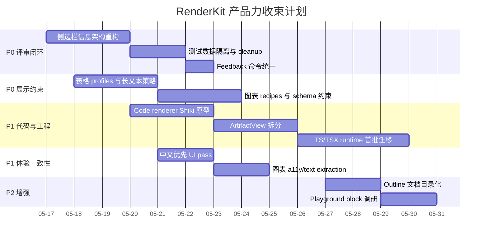

# RenderKit 产品力收束横道图

:::sum{id="gantt-summary" title="结论" width="wide"}
代码块升级只是其中一项。当前 RenderKit 更真实的状态是：主链路可用，但产品力收束还缺一批 P0/P1 工作，尤其是评审侧边栏、测试数据隔离、TypeScript/runtime 结构、中文优先、表格/图表展示约束、成熟组件策略。后续应该把它当成一个产品化 backlog，而不是单点修补。
:::

::::grid{id="p0-grid" columns="3" title="P0：先修会直接影响评审体验的问题" width="wide"}
:::alert{id="p0-sidebar" title="侧边栏减负"}
当前右侧 pane 混合评论列表、当前块、输入框、Agent handoff、metadata 和 raw id。需要拆成明确的信息架构。
:::

:::alert{id="p0-data-hygiene" title="测试数据隔离"}
smoke/browser verifier 污染 demo artifact，导致真实页面出现重复 smoke comments。
:::

:::alert{id="p0-feedback-command" title="反馈命令可靠性"}
UI 里出现 `rk feedback` 这类不可靠命令，应该生成真实可执行的 `renderkit feedback <source-file>` 或清晰 artifact/source 映射。
:::
::::

:::table{id="backlog-table" title="统一 backlog" width="wide"}
| 优先级 | 模块 | 问题 | 目标交付物 | 验收信号 |
|---|---|---|---|---|
| P0 | 评审侧边栏 | 信息混杂，像数据库调试面板 | `评论 / 当前块 / Agent` 三个明确 tab；隐藏 raw ids；评论按 block/thread 分组 | `pw` 点击 Review/💬 后，人类只看到评审所需信息 |
| P0 | 测试数据 | verifier 污染真实 artifact | 临时 artifact/测试 namespace/cleanup 机制 | demo artifact 没有重复 `Smoke test quote comment` |
| P0 | Agent handoff | feedback 命令不可靠 | UI/菜单/skill 统一真实 `renderkit feedback ...` | 复制命令后终端直接可执行 |
| P0 | 表格约束 | 长文本表格不好看，不能假装 Excel | 表格 profiles：matrix/status/key-value/compact/cards；超长内容自动降级 | 长文本表格不撑爆页面，移动端/打印可读 |
| P0 | 图表约束 | 图表自由发挥导致表现不稳定 | chart recipes + schema；限制图表类型、字段、标签长度 | ECharts/diagram examples 稳定，`pw read-text` 不污染正文 |
| P1 | Code renderer | 当前代码块普通 | Shiki/Expressive Code 风格静态 code block | line numbers/diff/frame/copy/print/selection comment 通过 |
| P1 | TypeScript runtime | 只有 typed boundary，runtime 未迁移 | 先拆 `ArtifactView` 状态，再迁移关键模块 TS/TSX | 单文件复杂度下降，`pnpm verify:contracts` 继续绿 |
| P1 | 中文优先 | UI 文案中英混杂 | Review UI、状态、空态、按钮中文化 | 页面默认中文，技术名保留英文 |
| P1 | Mermaid/SVG a11y | `pw read-text` 读出大量 SVG/CSS | 图表可访问文本清理，caption/aria 优先 | `pw read-text --selector main` 不输出 SVG 样式垃圾 |
| P1 | 代码结构 | `ArtifactView.jsx` 过重 | 拆 comment state、panel state、selection、highlight、context menu | 组件职责清楚，后续改动风险降低 |
| P2 | Outline | 当前是 block 列表，不是真目录 | headings first，titled blocks optional | 目录像文档导航，不像 debug navigator |
| P2 | Playground | 默认 code 不应变 live editor | 单独 `playground` block 调研 Sandpack/CodeMirror | 不污染默认阅读路径 |
:::

:::fig{id="gantt-plan" caption="产品力收束横道图（建议节奏）" width="wide"}

:::

::::compare{id="table-strategy" title="表格：不要假装 Excel，要做展示型约束组件" width="wide"}
| 方向 | 适合 RenderKit | 原因 | 建议 |
|---|---|---|---|
| 自由 Markdown table | 低 | 长文本、窄屏、打印都容易崩 | 只保留为简单矩阵入口 |
| Excel-like grid | 中低 | 展示能力强但交互/虚拟滚动/列宽管理复杂 | 不做默认；未来 data-grid block 再评估 |
| TanStack Table | 中高 | headless、可控，适合排序/列定义/自定义 cell | 可作为成熟模块候选，但需要自己做视觉/容器策略 |
| AG Grid / Handsontable | 低到中 | 功能强但重，偏应用表格 | 不适合默认文档阅读；可作为 future special block |
| 展示型 profiles | 高 | Agent 可控，读者易扫读 | P0 推荐：matrix/status/key-value/cards/compact |
::::

:::table{id="table-profiles" title="建议表格 profiles" width="wide"}
| Profile | 用途 | 行为约束 | 长文本策略 |
|---|---|---|---|
| `matrix` | 风险矩阵、方案对比 | 固定 3-5 列，表头短 | 单元格最多两行，超出变 detail note |
| `status` | 任务/风险列表 | 列固定：状态、事项、owner、下一步 | 主文本列可换行，其他列窄 |
| `key-value` | 配置/元信息 | 两列布局 | value 支持 code wrap |
| `cards` | 长文本比较 | 每行转卡片 | 不使用传统 table grid |
| `compact` | 数字/指标 | 小字体、高密度 | 禁止长段落 |
:::

:::fig{id="table-decision-flow" caption="表格渲染决策流" width="wide"}
flowchart TD
  A[Agent wants table] --> B{列数 <= 5?}
  B -- no --> C[改成 cards 或 sub-sections]
  B -- yes --> D{单元格是否长文本?}
  D -- yes --> E[profile=cards 或 status 主文本列]
  D -- no --> F[profile=matrix/compact]
  E --> G[RenderKit validates profile]
  F --> G
  G --> H[Readable table/card display]
:::

:::table{id="chart-strategy" title="图表：成熟模块 + schema 约束" width="wide"}
| 图表类型 | 当前问题 | 约束策略 | 成熟模块方向 |
|---|---|---|---|
| ECharts line/bar/pie | 数据自由，标签长时难看 | recipes 限制字段、label 长度、legend 数量 | 继续用 ECharts，但加 schema/recipe |
| Mermaid | 可表达流程，但 a11y text 污染 | server/pre-render 或 sanitize SVG text；限制复杂度 | Mermaid 继续保留，但要清理输出 |
| D2/PlantUML | local-first 价值高，但依赖环境 | 环境诊断 + fallback 明确 | 继续作为工程图专用 |
| Infographic | 容易变装饰 | 限定 KPI/card/flow 三类 | 自研轻量即可 |
:::

:::roadmap{id="next-batches" title="下一批建议执行顺序" width="wide"}
- [active] Batch A：侧边栏 P0。重构 panel state；评论列表人类化；Agent metadata 收折；修 feedback command。
- [active] Batch B：数据卫生 P0。verifier 隔离 artifact；cleanup；demo 重置；避免 smoke comments 污染。
- [next] Batch C：表格/图表约束 P0。新增 table profiles、chart recipes/schema、能力 fixtures。
- [next] Batch D：Code renderer P1。Shiki/Expressive Code 风格静态 renderer；code-presentation fixture。
- [planned] Batch E：工程收束 P1。拆 `ArtifactView.jsx`，首批 runtime TS/TSX migration。
- [planned] Batch F：中文优先 + a11y。UI 文案中文化，Mermaid/SVG text extraction 清理。
:::

:::todo{id="decision-checklist" title="需要你裁决的问题" width="wide"}
- [ ] 侧边栏要偏 Notion comments thread，还是偏代码 review queue？
- [ ] 表格默认是否禁止超过 5 列？超过后强制 cards/profile？
- [ ] 长文本表格是否允许折叠，还是必须改成卡片？
- [ ] 图表是否只允许 recipe，不允许任意自由配置？
- [ ] Code renderer 是否先上 Shiki server/pre-render，还是允许 client prototype？
- [ ] TypeScript 是 P1 必做，还是只迁移高风险模块？
- [ ] 中文优先是否要求所有 UI 文案马上统一？
:::

:::note{id="implementation-note" title="执行纪律" width="wide"}
这份横道图不是完成声明，是下一轮产品化收束计划。每个 batch 都应该有独立 pass 文档、fixture、verifier、`pw` 证据。尤其表格和图表，不应让 Agent 自由发挥，而应通过 profiles/recipes 把展示质量锁住。
:::
