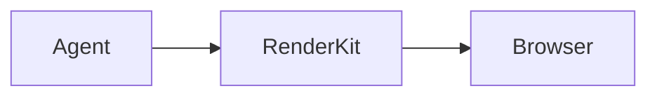
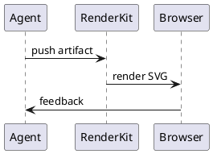

# RenderKit（Ripple）完整系统说明书

状态：当前实现说明  
版本：`0.0.2-alpha.0`  
仓库：`~/Worker/tools/RenderKit`  
日期：2026-05-17

---

## 1. 项目定位

RenderKit 是一个本地优先的 Agent-to-UI artifact renderer。它不是 Markdown 美化器，也不是一个普通文档站点。它的核心目标是让 Agent 能把结构化工作结果写成 `.rk.md`，再由 RenderKit 编译、验证、渲染成高密度、可审阅、可评论、可反馈给 Agent 的本地页面。

更具体地说，RenderKit 解决的是这条闭环：

```text
Agent 写 .rk.md
  → CLI validate
  → CLI push
  → Web 渲染成文档 artifact
  → 人按 block 评论 / 提建议
  → CLI feedback 拉回评论
  → Agent 修改源文件并 push 新 revision
```

这个项目的关键设计原则是：

1. **正文是主角**：渲染出来首先应该是一篇干净的文档，而不是一个 dashboard 或后台管理页。
2. **Web 不直接改正文**：人类只评论、建议、复制反馈命令；真正的正文修改由 Agent 回到 `.rk.md` 源文件完成。
3. **`.rk.md` 是主格式**：JSON/AST 是内部编译产物，不要求人或 Agent 直接写 JSON。
4. **本地优先**：不依赖 SaaS、登录、数据库、Docker 或 MCP。当前数据存在本机 `~/.renderkit/data`。
5. **可验证优先**：每个能力尽量有示例、fixture、脚本验证和真实浏览器检查。

---

## 2. 当前系统能力总览

当前 RenderKit 已实现以下能力：

| 能力 | 当前状态 | 主要文件 |
|---|---|---|
| `.rk.md` DSL 解析 | 已实现 | `packages/dsl/src/index.mjs` |
| frontmatter | 已实现：`title`、`theme`、`surface` | `packages/dsl/src/index.mjs` |
| block 校验 | 已实现：未知 block、缺 id、重复 id、坏 id、代码块 body 等 | `scripts/verify.mjs`、`examples/fixtures/*` |
| CLI validate/push/status/feedback/server | 已实现 | `packages/cli/bin/renderkit.mjs` |
| 本地数据存储 | 已实现：SQLite at `~/.renderkit/data/renderkit.db` | `apps/web/lib/db.mjs`、`apps/web/lib/store.mjs` |
| Web 文档渲染 | 已实现，文档优先 UI | `apps/web/app/a/[id]/ArtifactView.jsx` |
| 评论/反馈闭环 | 已实现；支持 block comments、selection-aware quote comments、persistent quote highlights、resolve/reopen、wide-surface supporting pane | `apps/web/app/api/artifacts/[id]/*`、`ArtifactView.jsx` |
| block renderer 包 | 已拆出 | `packages/blocks/src/*` |
| design token/theme/surface | 已实现 | `packages/design/src/*` |
| 默认白色文档主题 | 已实现：`paper-light` | `packages/dsl/src/index.mjs`、`packages/design/src/themes.css` |
| 暗黑/终端/长文主题 | 已实现：`dark-pro`、`amber-terminal`、`editorial-kami` | `packages/design/src/themes.css` |
| grid 二维布局 | 已实现 | `GridBlock.jsx`、`examples/capabilities/grid-layout.rk.md` |
| table 技术表格 | 已实现 | `TableBlock.jsx`、`examples/capabilities/product-system.rk.md` |
| image 富媒体图片 | 已实现 | `ImageBlock.jsx`、`examples/capabilities/rich-media-tabs.rk.md` |
| tabs 多视图内容 | 已实现 | `TabsBlock.jsx`、`examples/capabilities/rich-media-tabs.rk.md` |
| stat/checklist/quote 编辑化组件 | 已实现 | `StatBlock.jsx`、`ChecklistBlock.jsx`、`QuoteBlock.jsx`、`examples/capabilities/editorial-components.rk.md` |
| comparison/timeline 叙事组件 | 已实现 | `ComparisonBlock.jsx`、`TimelineBlock.jsx`、`examples/capabilities/narrative-blocks.rk.md` |
| subdocument 子文档块 | 已实现 | `SubdocumentBlock.jsx` |
| Mermaid | 已实现浏览器渲染 | `MermaidDiagram.jsx` |
| SVG | 已实现安全内嵌 | `DiagramBlock.jsx` |
| ECharts | 已实现浏览器渲染，支持 raw JSON 和 `echarts-bar`/`echarts-line`/`echarts-pie` CSV-like shorthand | `EChartsBlock.jsx` |
| infographic | 已实现轻量指标卡 | `DiagramBlock.jsx` |
| D2 | 已实现本地 WASM server render | `apps/web/app/api/render/diagram/route.js` |
| PlantUML | 已实现本地 PlantUML jar server render | `apps/web/app/api/render/diagram/route.js` |
| diagram visual language | 已实现规范与 fixture | `docs/renderkit-diagram-visual-language.md`、`examples/capabilities/diagram-visual-language.rk.md` |
| gallery/examples | 已实现 | `examples/gallery.json`、`apps/web/app/gallery/page.jsx` |
| authoring skill | 已实现 | `skills/renderkit-authoring/SKILL.md` |
| 验证脚本 | 已实现 | `scripts/verify.mjs`、`scripts/verify-smoke.mjs` |

---

## 3. Monorepo 结构

当前仓库是 pnpm workspace：

```text
RenderKit/
├── apps/
│   └── web/                  # Next.js 本地 Web renderer 和 API server
├── packages/
│   ├── cli/                  # renderkit CLI
│   ├── dsl/                  # .rk.md parser / compiler / validator
│   ├── blocks/               # React block renderer registry
│   ├── design/               # CSS tokens/themes/surfaces/blocks/chrome
│   └── shared/               # shared constants and recipe registry
├── examples/
│   ├── alpha-showcase.rk.md  # 当前主 showcase
│   ├── capabilities/         # 能力验证 case：diagram/grid/rich media/editorial/narrative
│   ├── fixtures/             # bad fixture，用于验证错误码
│   ├── surfaces/             # surface recipes 示例
│   └── theme-cases/          # theme strategy 截图/验证 case
├── docs/                     # PRD、决策、主题策略、测试计划等正式文档
├── scripts/                  # verify harness
└── skills/                   # Agent authoring skill
```

分包职责：

### `packages/dsl`

负责把 `.rk.md` 编译为内部 model。它做三件事：

1. 解析 frontmatter。
2. 识别 Markdown heading/paragraph 和 directive blocks。
3. 产出可渲染 model，并给出 errors/warnings。

当前已知 block 类型：

```js
callout
decision-card
diagram
code
summary
subdocument
grid
table
image
tabs
stat
checklist
quote
comparison
timeline
```

默认主题：

```js
DEFAULT_THEME = 'paper-light'
```

支持主题：

```js
paper-light
editorial-kami
dark-pro
amber-terminal
```

支持 surface：

```js
engineering-plan
decision-brief
review-report
runbook
data-report-lite
```

### `packages/blocks`

负责 React block 渲染。`RenderBlock` 根据 `block.type` 从 registry 里选择组件。当前组件包括：

```text
HeadingBlock
ParagraphBlock
SummaryBlock
CalloutBlock
DecisionBlock
CodeBlock
DiagramBlock
EChartsBlock
GridBlock
SubdocumentBlock
MermaidDiagram
BlockFrame
```

`BlockFrame` 是 review affordance 层。Reading mode 默认隐藏 heavy metadata；Review mode 才展示 block/review affordances。它负责：

- `data-block-id`
- `data-block-type`
- selected 状态
- comment count
- `⋯` 更多菜单入口
- `💬` 评论入口

正文内容仍由具体 block component 渲染。

### `packages/design`

负责 CSS-only design system。它不是 React component library，而是 token/theme/surface/block/chrome 的 CSS 合同。

主要文件：

```text
tokens.css     # spacing, radius, typography, shadow, motion, z-index
/themes.css    # paper-light, editorial-kami, dark-pro, amber-terminal
surfaces.css   # engineering-plan, decision-brief, review-report, runbook, data-report-lite
blocks.css     # block-level styles
chrome.css     # app chrome utilities
index.css      # import entry
```

### `packages/cli`

本地 CLI，当前命令：

```bash
renderkit validate <file>.rk.md --json
renderkit push <file>.rk.md --open --json
renderkit status <file-or-artifact-id> --json
renderkit feedback <file-or-artifact-id> --json
renderkit server start
renderkit server status --json
```

CLI 的核心作用不是编辑文档，而是把 Agent 写好的 `.rk.md` 推到本地 server，并拉回人类评论。

### `apps/web`

Next.js 应用，承担两类职责：

1. Web 文档 renderer。
2. 本地 API server。

主要路径：

```text
/a/[id]                         # artifact 页面
/gallery                        # 示例 gallery
/api/artifacts                  # 创建 artifact
/api/artifacts/[id]             # 读取 artifact
/api/artifacts/[id]/revisions   # 添加 revision
/api/artifacts/[id]/comments    # 添加评论
/api/artifacts/[id]/feedback    # 拉取 agent feedback
/api/render/diagram             # D2 / PlantUML 本地渲染 API
/api/health                     # server status
```

---

## 4. `.rk.md` 格式

`.rk.md` 是 Markdown + directive blocks。它保持人类可读，也适合 Agent 生成。

典型 frontmatter：

```yaml
---
title: API Gateway Migration Plan
theme: paper-light
surface: engineering-plan
---
```

普通 Markdown heading 会变成 heading block：

```md
# Migration Plan
```

普通段落会变成 paragraph block：

```md
This plan migrates API traffic behind a new gateway.
```

带稳定 id 的 directive block 是长期 review 的核心，因为评论锚点依赖 block id。

---

## 5. Block Catalog

### 5.1 `summary`

用于高密度摘要。

```md
:::summary{id="project-summary" title="项目摘要"}
RenderKit 是本地 Agent artifact renderer。
:::
```

属性：

| 属性 | 说明 |
|---|---|
| `id` | 必填，稳定评论锚点 |
| `title` | 可选标题 |
| `width` / `span` | 可选布局宽度 |

### 5.2 `callout`

用于风险、状态、提示、警告。

```md
:::callout{id="risk-note" tone="warning" title="风险" width="half"}
PlantUML 某些图类型需要 Graphviz。
:::
```

支持 tone：

```text
info
warning
danger
success
neutral
```

### 5.3 `decision-card`

用于决策记录。body 是 YAML。

```md
:::decision-card{id="theme-choice"}
question: 默认主题是什么？
chosen: paper-light
status: approved

rationale:
  - 白色文档更适合正常阅读和截图
  - 暗黑主题作为 opt-in

alternatives:
  - name: dark-pro
    reason: 仅适合明确需要暗黑模式的场景
:::
```

必填字段：

```text
question
chosen
```

### 5.4 `code`

用于代码、命令、配置片段。必须包含 fenced code block。

````md
:::code{id="cli-example" language="bash" title="CLI"}
```bash
renderkit validate plan.rk.md --json
renderkit push plan.rk.md --open --json
```
:::
````

### 5.5 `diagram`

用于图表和信息图。推荐包含 fenced code block；Mermaid 也支持无 fence 的 inline body shorthand。

支持 engine：

| engine | 当前行为 |
|---|---|
| `mermaid` | 浏览器内 Mermaid 渲染；可由 `fig` shorthand 默认推断 |
| `svg` | 安全清洗后 inline SVG |
| `echarts` | 浏览器内 ECharts 渲染，接受 raw option JSON |
| `echarts-bar` / `echarts-line` / `echarts-pie` | 浏览器内 ECharts 渲染，接受 CSV-like data |
| `infographic` | RenderKit 内置轻量指标卡渲染 |
| `d2` | 本地 server 通过 `@terrastruct/d2` WASM 渲染 SVG |
| `plantuml` | 本地 server 通过 `plantuml.jar` + Java 渲染 SVG |

示例：

````md
:::diagram{id="flow" engine="mermaid" caption="流程"}

:::
````

D2 示例：

````md
:::diagram{id="d2-flow" engine="d2" caption="D2"}
```d2
agent -> renderkit: push
renderkit -> browser: render
browser -> agent: feedback
```
:::
````

PlantUML 示例：

````md
:::diagram{id="plantuml-flow" engine="plantuml" caption="PlantUML"}

:::
````

### 5.6 `subdocument`

用于文档内嵌文档、子文档引用、附件式计划。

```md
:::subdocument{id="child-plan" title="API migration child plan" source="examples/surfaces/engineering-plan.rk.md" surface="engineering-plan" status="linked"}
这个子文档承载详细迁移步骤，父文档只保留摘要和入口。
:::
```

当前 `subdocument` 是一个可评论 block。它可带：

| 属性 | 说明 |
|---|---|
| `title` | 子文档标题 |
| `source` | 本地源文件路径 |
| `artifactId` | 未来可链接已 push artifact |
| `revision` | 可选 revision |
| `surface` | 子文档类型 |
| `status` | linked/draft 等状态文案 |

### 5.7 `grid`

用于二维布局。它解决“每行只能一个 block”的密度问题。`grid` 可把多个子 block 排成列。

示例：

````md
::::grid{id="kpi-grid" columns="3" title="KPI grid"}
:::summary{id="metric-a" title="Velocity"}
12 shipped artifacts this week.
:::

:::callout{id="metric-b" tone="success" title="Quality"}
128 verifier checks passing.
:::

:::callout{id="metric-c" tone="warning" title="Follow-up"}
PlantUML 某些图类型需要 Graphviz。
:::
::::
````

设计约束：

- `grid` 可以包含普通 block。
- 当前不允许 grid 嵌套 grid。
- 子 block 保留 `data-block-id`，因此可右键、检查、评论。
- `grid` 适合 KPI、对比项、双栏决策、报告摘要。

### 5.8 `table`

用于技术表格、风险矩阵、状态追踪、发布门禁和对比项。

```md
:::table{id="risk-table" title="Risk matrix" width="wide"}
| Area | Current signal | Decision impact | Owner |
|---|---|---|---|
| Queue latency | p95 142ms | Continue rollout | SRE |
| Rollback | Config-only tested | Safe to proceed | Release |
:::
```

`table` 支持 GFM Markdown table body，并编译为 `columns`、`rows`、`align`，由 `TableBlock.jsx` 渲染为高密度技术表格。

### 5.9 `image`

用于截图、架构图、生成 SVG、产品 mockup 和 blog-style hero figure。

```md
:::image{id="architecture" src="./architecture.png" alt="System architecture" title="Architecture" aspect="16:9" width="wide"}
Optional caption text.
:::
```

### 5.10 `tabs`

用于高密度多视图内容，例如 Reader/Reviewer、Before/After、Option A/B/C、平台差异步骤。

````md
:::::tabs{id="delivery-tabs" title="Delivery views" width="wide"}
::::tab{id="reader" label="Reader view"}
:::note{id="reader-note" title="Reader-first"}
Default view should read like a finished document.
:::
::::
:::::
````

### 5.11 `stat` / `metric`

用于 KPI、指标卡和产品状态数字。

```md
:::metric{id="adoption" label="Adoption" value="74%" delta="+18%" tone="success"}
Share of artifacts using visual blocks.
:::
```

### 5.12 `checklist` / `todo`

用于 readiness gates、任务清单和 review punch list。

```md
:::todo{id="ship-checklist" title="Readiness checklist"}
- [x] Reading-first layout
- [ ] Robust re-anchoring
:::
```

### 5.13 `quote`

用于产品原则、专家评论和 blog-style pull quote。

```md
:::quote{id="principle" cite="RenderKit principle" role="Agent-to-UI"}
The artifact should make the next decision obvious before the reader opens raw source.
:::
```

---

## 6. Layout System

RenderKit 有两类布局能力。

### 6.1 block width

大多数 directive block 支持：

```md
width="half"
width="third"
width="two-third"
width="full"
```

内部会落到：

```html
data-rk-width="half"
```

CSS 用 12 栏网格控制宽度：

```css
.rk-block-stream > .rk-block[data-rk-width="half"] { grid-column: span 6; }
.rk-block-stream > .rk-block[data-rk-width="third"] { grid-column: span 4; }
.rk-block-stream > .rk-block[data-rk-width="two-third"] { grid-column: span 8; }
```

### 6.2 grid block

`grid` 是显式二维布局块。它更适合“一个逻辑区块里多个单元”的表达，例如：

- 三个 KPI 卡片。
- 两列方案对比。
- 左侧决策 + 右侧子文档。
- 多个图表并排。

---

## 7. Web App 设计

### 7.1 从 dashboard 改为 document-first

当前 Web renderer 不再默认显示笨重 topbar、metadata 表格、artifact id、revision、theme 等信息。默认页面结构是：

```jsx
<div className="rk-page" data-rk-theme={theme} data-rk-surface={surface}>
  <main className="rk-document">
    <div className="rk-block-stream">
      ...blocks
    </div>
  </main>
</div>
```

这符合当前产品判断：正文是一篇文档，不是后台系统页面。

### 7.2 副功能默认收起

副功能包括：

- Outline。
- Comments。
- Feedback command。
- Block source inspector。
- Wide-surface supporting pane。
- Selection-aware quote comments。

它们默认不占主位置，而是通过右上角浮动控件、抽屉或 Review 模式 supporting pane 打开。

浮动控件：

```text
☰   打开 outline
💬  打开 comments/review drawer
⎘   复制 feedback command
```

### 7.3 右键与编辑建议

任意 block 支持：

- 右键打开 context menu。
- 点击 `⋯` 打开 context menu。
- 点击 `💬` 打开评论抽屉。

Context menu 当前包括：

```text
Inspect / source
Comment
Suggest edit as comment
Copy block ID
Copy feedback command
Copy source location
```

注意：`Suggest edit as comment` 不会修改正文。它只是打开评论入口，让用户把编辑建议写成 comment。Agent 再通过 CLI feedback 拉取建议并修改 `.rk.md`。

用户也可以选中文本并创建 selection-aware comment。RenderKit 会保存类似 W3C `TextQuoteSelector` 的 `exact`/`prefix`/`suffix` quote anchor，并在 feedback 中返回给 Agent。open selector comments 会在支持 Custom Highlight API 的浏览器里高亮对应文本；resolved comments 会从 Agent feedback 中移除。

这是核心产品边界：**Web UI 不强行处理正文。**

### 7.4 Drawer / Supporting Pane 内容

选择 block 后，review drawer 或 wide-surface supporting pane 展示：

- Selected block。
- Source range。
- Source excerpt。
- Properties。
- Comments on this block。
- Selected quote（如果评论来自文本选择）。
- Add comment。
- Agent handoff / feedback command。
- All comments。

这让人类能定位问题，但不会破坏源文件所有权。

---

## 8. Theme Strategy

主题策略记录在：

```text
docs/theme-strategy.md
```

当前原则：

1. 默认 `paper-light`。
2. `dark-pro` 只是 opt-in，不再作为默认。
3. `editorial-kami` 用于长文、PRD、策略文档。
4. `amber-terminal` 用于 runbook、CLI-heavy 场景。
5. theme 是阅读环境，surface 是信息结构，两者不能互相硬绑。
6. 所有 theme 必须支持核心 block，不能出现黑底看不清、低对比、AI 模板感。

Theme case 文件：

```text
examples/theme-cases/paper-light-doc.rk.md
examples/theme-cases/editorial-kami-doc.rk.md
examples/theme-cases/dark-pro-dev.rk.md
examples/theme-cases/amber-terminal-runbook.rk.md
```

这些文件不是 demo 摆设，而是验证 theme 策略的 case。

---

## 9. Surface Recipes

surface 描述 artifact 的信息形状。当前 surface：

```text
engineering-plan
decision-brief
review-report
runbook
data-report-lite
```

recipe registry 在：

```text
packages/shared/src/index.mjs
```

每个 recipe 包含：

- label。
- description。
- recommendedTheme。
- recommendedBlocks。
- structure。
- antiPatterns。

示例文件：

```text
examples/surfaces/engineering-plan.rk.md
examples/surfaces/decision-brief.rk.md
examples/surfaces/review-report.rk.md
examples/surfaces/runbook.rk.md
examples/surfaces/data-report-lite.rk.md
```

Gallery：

```text
examples/gallery.json
apps/web/app/gallery/page.jsx
```

---

## 10. Local Data Model

本地数据目录：

```text
~/.renderkit/data
```

主要结构：

```text
~/.renderkit/data/
├── index.json
└── artifacts/
    └── art_xxxxx/
        ├── rev-1.json
        ├── rev-2.json
        └── comments.json
```

revision 文件保存：

- `sourceText`
- `sourceHash`
- `model`
- `blockIds`
- `createdAt`

comments 文件保存：

- comment id。
- artifact id。
- block id。
- comment text。
- status：`open` / `resolved` / `orphaned`。
- createdAtRevision。
- blockSnapshot。

当 Agent push 新 revision 时：

1. 重新 parse `.rk.md`。
2. 写入新 revision。
3. 计算 added/removed/modified blocks。
4. 被删除 block 上的 open comment 变成 orphaned。
5. `--resolve` 指定的 comment 标记 resolved。

---

## 11. CLI Workflow

### 11.1 启动 server

```bash
pnpm dev
```

或：

```bash
node packages/cli/bin/renderkit.mjs server start
```

### 11.2 验证文件

```bash
node packages/cli/bin/renderkit.mjs validate examples/alpha-showcase.rk.md --json
```

验证会返回：

- `ok`
- `model`
- `errors`
- `warnings`

### 11.3 Push artifact

```bash
node packages/cli/bin/renderkit.mjs push examples/alpha-showcase.rk.md --open --json
```

第一次 push 会创建 artifact，并写 lock 文件：

```text
examples/.alpha-showcase.rk.lock.json
```

后续 push 会创建新 revision。

### 11.4 查看 status

```bash
node packages/cli/bin/renderkit.mjs status examples/alpha-showcase.rk.md --json
```

### 11.5 拉取 feedback

```bash
node packages/cli/bin/renderkit.mjs feedback examples/alpha-showcase.rk.md --json
```

Agent 应读取 feedback，修改源 `.rk.md`，再 push。

---

## 12. API Contract

### 12.1 Artifacts

```text
POST /api/artifacts
GET  /api/artifacts/[id]
POST /api/artifacts/[id]/revisions
POST /api/artifacts/[id]/comments
GET  /api/artifacts/[id]/feedback
```

### 12.2 Diagram render

```text
POST /api/render/diagram
```

请求：

```json
{
  "engine": "d2",
  "code": "x -> y"
}
```

响应：

```json
{
  "ok": true,
  "engine": "d2",
  "svg": "<svg ...>...</svg>"
}
```

当前 server-rendered engines：

- `d2`：`@terrastruct/d2` WASM。
- `plantuml`：`plantuml.jar` + local Java。

PlantUML 注意：

- 当前环境 `java -version` 可用。
- Graphviz `dot` 当前未安装；PlantUML sequence diagram 可渲染，部分 diagram 类型可能需要 Graphviz。

---

## 13. Validation Harness

### 13.1 `pnpm verify`

命令：

```bash
pnpm verify
```

当前结果：

```text
212 passed, 0 failed
ALL GOOD
```

覆盖范围：

1. good examples 都能 validate。
2. 每个 block 都有 `sourceRange` 和 `sourceExcerpt`。
3. bad fixtures 按预期失败并返回指定错误码。
4. gallery index 存在且指向真实文件。
5. theme strategy case 覆盖 4 个 theme。
6. rendering capabilities case 覆盖 6 个 diagram engine。
7. grid layout case 有 grid block 且 grid 有 children。
8. Web build 成功。

### 13.2 `pnpm verify:smoke`

命令：

```bash
pnpm verify:smoke
```

当前结果：

```text
Results: 24 passed, 0 failed
ALL GOOD
```

覆盖范围：

1. server status。
2. push。
3. status。
4. feedback。
5. Selection comment API stores selector and feedback returns it.
6. Resolve/reopen lifecycle affects feedback visibility.
7. D2 render API 返回 SVG。
8. PlantUML render API 返回 SVG。

### 13.3 `pnpm verify:sqlite`

命令：

```bash
pnpm verify:sqlite
```

当前结果：

```text
Results: 102 passed, 0 failed
ALL GOOD
```

覆盖范围：多 artifact、多 revision、selector comments、resolve/reopen、nested tabs/grid feedback、orphaned comments、agent auto-resolve、selector normalization 和 cleanup。

### 13.4 Browser verification

使用 `pw` 做过真实浏览器验证：

- artifact 页面无 browser errors。
- diagram capability 页面无 browser errors。
- grid capability 页面无 browser errors。
- D2 / PlantUML block 在浏览器中进入 rendered 状态。
- grid child block 可右键打开菜单。
- context menu 有 inspect/comment/suggest/copy feedback。

---

## 14. Error and Warning Codes

当前已验证的错误码包括：

| Code | 含义 |
|---|---|
| `RK_PARSE_ERROR` | Markdown parse 失败 |
| `RK_FRONTMATTER_INVALID` | frontmatter YAML 无效 |
| `RK_UNKNOWN_BLOCK_TYPE` | 未知 directive block |
| `RK_BLOCK_ID_REQUIRED` | directive block 缺 id |
| `RK_BLOCK_ID_INVALID` | id 格式不合法 |
| `RK_DUPLICATE_BLOCK_ID` | 重复 id |
| `RK_PROP_REQUIRED` | 必填属性缺失 |
| `RK_DECISION_YAML_INVALID` | decision-card body YAML 无效 |
| `RK_DIAGRAM_CODE_REQUIRED` | diagram 缺 fenced code |
| `RK_UNSUPPORTED_DIAGRAM_ENGINE` | diagram engine 不支持 |
| `RK_CODE_BODY_REQUIRED` | code block 缺 fenced code |
| `RK_TABLE_BODY_REQUIRED` | table block 缺 GFM Markdown table body |
| `RK_IMAGE_SRC_REQUIRED` | image block 缺 `src` |
| `RK_TABS_CHILD_REQUIRED` | tabs block 缺 tab child |
| `RK_TABS_CHILD_UNSUPPORTED` | tabs 下出现非 tab child |
| `RK_TABS_BLOCK_UNSUPPORTED` | tab 内出现不支持的 nested block |
| `RK_STAT_VALUE_REQUIRED` | stat/metric block 缺 `value` |
| `RK_CHECKLIST_BODY_REQUIRED` | checklist/todo block 缺 list items |
| `RK_QUOTE_BODY_REQUIRED` | quote block 缺 body text |
| `RK_GRID_CHILD_UNSUPPORTED` | grid 子 block 不支持 |
| `RK_THEME_UNKNOWN` | theme 未知，fallback 到 `paper-light` |
| `RK_SURFACE_UNKNOWN` | surface 未知，允许但 warning |

---

## 15. Examples and Cases

### Main showcase

```text
examples/alpha-showcase.rk.md
```

展示：

- paper-light default。
- summary/callout/decision/code/subdocument/diagram。
- `width="half"`。
- Agent feedback loop。

### Capability cases

```text
examples/capabilities/diagram-engines.rk.md
examples/capabilities/grid-layout.rk.md
```

分别约束：

- diagram engines。
- grid/layout capability。

### Theme cases

```text
examples/theme-cases/*.rk.md
```

约束：

- paper-light。
- editorial-kami。
- dark-pro。
- amber-terminal。

### Surface examples

```text
examples/surfaces/*.rk.md
```

覆盖：

- engineering plan。
- decision brief。
- review report。
- runbook。
- data report lite。

---

## 16. Agent Authoring Rules

Agent 写 `.rk.md` 时应遵守：

1. 先选择 surface，再选择 theme。
2. 默认 theme 使用 `paper-light`。
3. 需要长期评论锚点时，用 directive block，不依赖自动 heading/paragraph id。
4. 每个 directive block 必须有稳定 `id`。
5. 不要把所有内容写成普通段落；用 summary/callout/decision/code/diagram/grid 组织信息。
6. 不要用 Web UI 改正文；收到评论后改 `.rk.md` 并 push。
7. 图表优先选择可本地渲染 engine。
8. 高密度信息使用 `grid`，不要硬塞成很长列表。
9. 子文档使用 `subdocument`，不要把完整子文档复制进父文档。

Authoring skill：

```text
skills/renderkit-authoring/SKILL.md
```

---

## 17. 当前边界与风险

### 17.1 Alpha 不做的事

当前没有：

- SaaS。
- 多用户权限。
- 登录/auth。
- 数据库。
- Docker。
- MCP server。
- npm/global package 发布。
- Web 正文编辑器。

这些不是遗漏，而是当前 local-first Alpha 的边界。

### 17.2 Comment anchoring 风险

directive block id 是稳定锚点。heading/paragraph 是自动 id：

```text
heading-1
paragraph-1
```

如果文档结构变化，自动 id 可能漂移。因此重要评论应尽量落在 directive block 上。

### 17.3 PlantUML 环境依赖

PlantUML 当前通过本地 Java + `plantuml.jar` 渲染 SVG。sequence diagram 已验证可用。某些 PlantUML 图类型依赖 Graphviz；当前环境 `dot` 未安装，因此这些图类型可能失败并进入 fallback。

### 17.4 D2 包体积

D2 使用 `@terrastruct/d2` WASM，本地能力完整，但依赖体积较大。这是“本地真渲染”与“轻量依赖”的取舍。

### 17.5 CLI server start 当前问题

`renderkit server start` 当前实现通过 pnpm 启动 Next dev server。源码 checkout 场景可用，但正式分发时需要重新设计 standalone server packaging。

---

## 18. 后续路线

### 18.1 近期优先级

1. 修正 `renderkit server start --port` 参数转发，使 CLI 启动更稳。
2. 给 PlantUML 增加环境诊断：Java/Graphviz 检查。
3. 给 diagram render API 增加缓存，避免重复渲染大图。
4. 给 `grid` 增加更明确的 cell span 能力。
5. 给 `subdocument` 接真实 artifact link 和 feedback 汇总。
6. 给 gallery 增加“push example/open rendered artifact”能力。

### 18.2 中期能力

1. Recipe lint：根据 surface 检查是否符合 recommended blocks。
2. 更强表格/数据 block。
3. 图片/SVG/file attachment block。
4. PDF/export。
5. Artifact compare/diff UI。
6. URL hash block selection。
7. block-level stable anchors for headings/paragraphs。

### 18.3 远期能力

1. 单包发布。
2. Standalone local server。
3. SQLite migration/backfill tooling。
4. 多项目 workspace。
5. Agent task integration。
6. 可插拔 renderer registry。

---

## 19. 操作手册

### 安装依赖

```bash
cd ~/Worker/tools/RenderKit
pnpm install
```

### 启动 Web

```bash
pnpm dev
```

默认地址：

```text
http://localhost:3737
```

### 验证

```bash
pnpm verify
pnpm verify:smoke
```

### Push showcase

```bash
node packages/cli/bin/renderkit.mjs push examples/alpha-showcase.rk.md --open --json
```

### Push capability case

```bash
node packages/cli/bin/renderkit.mjs push examples/capabilities/diagram-engines.rk.md --open --json
node packages/cli/bin/renderkit.mjs push examples/capabilities/grid-layout.rk.md --open --json
```

### 拉取反馈

```bash
node packages/cli/bin/renderkit.mjs feedback examples/alpha-showcase.rk.md --json
```

---

## 20. 当前提交状态

最近关键提交：

```text
ef83751 render plantuml and d2 locally
0ef74ec productize renderkit document renderer
41eb64e harden visual artifact validation and contrast fixes
10db11f document renderkit test plan
b19a001 visual artifact system: design tokens, themes, code/summary blocks, skill, showcase
```

其中：

- `0ef74ec` 完成文档优先 renderer、theme strategy、grid、subdocument、recipes/gallery、block extraction、design system 大改。
- `ef83751` 完成 D2/PlantUML 本地渲染 API 和 smoke 验证。

---

## 21. 总结

RenderKit 当前已经从一个 proof-of-concept 发展为一个可用的本地 Agent artifact review surface。它有自己的 DSL、CLI、Web renderer、block registry、design system、theme strategy、surface recipes、gallery、验证 harness 和真实浏览器检查流程。

它的核心产品判断是：

```text
Agent 负责写源文件。
Web 负责高质量渲染和评论。
人负责判断和反馈。
CLI 负责把反馈带回 Agent。
```

这让 RenderKit 与普通 Markdown renderer、在线文档编辑器、dashboard builder 区分开来。它不是让人在线改文档，而是让 Agent 输出可审阅 artifact，让人用 block-level comments 指挥 Agent 继续修改源文件。
