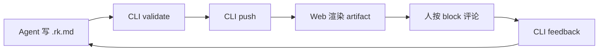

# RenderKit Alpha Showcase

这份文档用于展示 RenderKit Visual Artifact System 的核心能力：themes、surfaces、blocks、review chrome。

:::summary{id="project-summary" title="项目摘要"}
RenderKit 是本地 Agent artifact renderer。Agent 写 .rk.md 源文件，RenderKit 编译并渲染成高密度可审阅 artifact，人按 block 评论，Agent 通过 feedback 修改源文件，形成闭环。当前 Alpha 默认使用 paper-light 白色文档主题，dark-pro / amber-terminal 仅作为可选主题；同时支持 engineering-plan / decision-brief / review-report 等 surface 类型。
:::

:::callout{id="status-note" tone="info" title="当前状态" width="half"}
RenderKit 当前处于 Alpha 0.0.2 阶段，本地源码模式可用。核心链路已跑通：validate → push → render → comment → feedback → revise。
:::

:::callout{id="interaction-model" tone="info" title="交互模型" width="half"}
正文是主角；outline、comments、inspector 都是可展开副功能。右键和提示只生成评论/反馈命令，不直接改正文。
:::

:::decision-card{id="theme-choice"}
question: Artifact 视觉主题选择
chosen: paper-light
status: approved

rationale:
  - 默认文档应该是白色/纸面风格，更符合正常阅读和截图预期
  - 暗黑主题容易显得像模板化 AI demo，应作为可选而不是默认
  - 轻量边框、清晰留白和稳定排版比高饱和渐变更成熟

alternatives:
  - name: dark-pro
    reason: 适合临时工程演示，但不适合作为默认文档体验
  - name: amber-terminal
    reason: 适配 amber/yellow terminal 审美，特定用户偏好
:::

:::callout{id="block-coverage" tone="success" title="Block 覆盖" width="half"}
本文档覆盖了 heading、paragraph、summary、callout、decision-card、code、diagram、table、tabs、stat、checklist 等 block 类型。
:::

:::code{id="cli-usage" language="bash" title="CLI 使用示例"}
```bash
# Validate before push
renderkit validate plan.rk.md --json

# Push and open browser
renderkit push plan.rk.md --open --json

# Check status
renderkit status plan.rk.md --json

# Pull feedback from human review
renderkit feedback plan.rk.md --json
```
:::

:::code{id="frontmatter-example" language="yaml" title="Frontmatter 格式"}
```yaml
title: 认证模块重构方案
theme: paper-light
surface: engineering-plan
```
:::

:::table{id="surface-reference-table" title="Surface reference" width="half"}
| Surface | Use |
|---|---|
| engineering-plan | Dense technical proposal |
| review-report | Findings and severity |
| documentation | Blog/Notion-style prose |
:::

:::diagram{id="renderkit-flow" engine="mermaid" caption="RenderKit Agent Review Loop"}

:::
