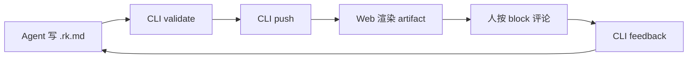

# RenderKit Alpha Showcase

这份文档用于展示 RenderKit Visual Artifact System 的核心能力：themes、surfaces、blocks、review chrome。

:::summary{id="project-summary" title="项目摘要"}
RenderKit 是本地 Agent artifact renderer。Agent 写 .rk.md 源文件，RenderKit 编译并渲染成高密度可审阅 artifact，人按 block 评论，Agent 通过 feedback 修改源文件，形成闭环。当前 Alpha 已支持 dark-pro / paper-light / amber-terminal 三个主题，以及 engineering-plan / decision-brief / review-report 等 surface 类型。
:::

:::callout{id="status-note" tone="info" title="当前状态"}
RenderKit 当前处于 Alpha 0.0.2 阶段，本地源码模式可用。核心链路已跑通：validate → push → render → comment → feedback → revise。
:::

:::decision-card{id="theme-choice"}
question: Artifact 视觉主题选择
chosen: dark-pro
status: approved

rationale:
  - 默认深色主题适合工程/决策场景
  - 高对比度减少阅读疲劳
  - 与主流开发工具视觉语言一致

alternatives:
  - name: paper-light
    reason: 适合长方案和截图场景，但不是默认首选
  - name: amber-terminal
    reason: 适配 amber/yellow terminal 审美，特定用户偏好
:::

:::callout{id="block-coverage" tone="success" title="Block 覆盖"}
本文档覆盖了 heading、paragraph、summary、callout、decision-card、code、diagram 等 block 类型。
:::

:::code{id="cli-usage" language="bash" title="CLI 使用示例"}
# Validate before push
renderkit validate plan.rk.md --json

# Push and open browser
renderkit push plan.rk.md --open --json

# Check status
renderkit status plan.rk.md --json

# Pull feedback from human review
renderkit feedback plan.rk.md --json
:::

:::code{id="frontmatter-example" language="yaml" title="Frontmatter 格式"}
title: 认证模块重构方案
theme: dark-pro
surface: engineering-plan
:::

:::diagram{id="renderkit-flow" engine="mermaid" caption="RenderKit Agent Review Loop"}

:::
