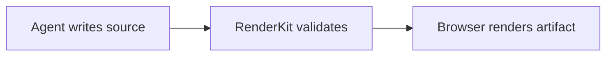
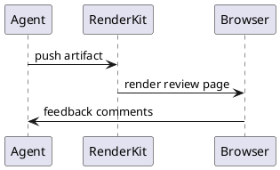

# Diagram Engine Capability Case

This case constrains RenderKit's chart/diagram embedding strategy across Mermaid, PlantUML, D2, SVG, ECharts, and infographic blocks.

:::summary{id="diagram-summary" title="Embedding policy"}
Mermaid, SVG, ECharts, and infographic render in the browser. PlantUML and D2 render through the local RenderKit server adapter, with source fallback only if local dependencies fail.
:::

:::diagram{id="mermaid-flow" engine="mermaid" caption="Mermaid flow"}

:::

:::diagram{id="svg-card" engine="svg" caption="Inline SVG"}
```svg
<svg viewBox="0 0 360 120" xmlns="http://www.w3.org/2000/svg" role="img" aria-label="Three stage pipeline">
  <rect x="10" y="20" width="95" height="60" rx="12" fill="#eff6ff" stroke="#2563eb"/>
  <rect x="132" y="20" width="95" height="60" rx="12" fill="#ecfdf5" stroke="#16a34a"/>
  <rect x="255" y="20" width="95" height="60" rx="12" fill="#fff7ed" stroke="#ea580c"/>
  <text x="57" y="55" text-anchor="middle" font-size="14">Draft</text>
  <text x="179" y="55" text-anchor="middle" font-size="14">Review</text>
  <text x="302" y="55" text-anchor="middle" font-size="14">Ship</text>
</svg>
```
:::

:::diagram{id="echarts-bars" engine="echarts" caption="ECharts bar chart"}
```json
{
  "tooltip": {},
  "xAxis": { "type": "category", "data": ["Docs", "Review", "Charts"] },
  "yAxis": { "type": "value" },
  "series": [{ "type": "bar", "data": [12, 8, 5] }]
}
```
:::

:::diagram{id="infographic-kpis" engine="infographic" caption="Infographic metrics"}
```json
[
  { "label": "Blocks", "value": "8+" },
  { "label": "Themes", "value": "4" },
  { "label": "Engines", "value": "6" }
]
```
:::

:::diagram{id="plantuml-source" engine="plantuml" caption="PlantUML local server render"}

:::

:::diagram{id="d2-source" engine="d2" caption="D2 local WASM render"}
```d2
agent -> renderkit: push
renderkit -> browser: render
browser -> agent: feedback
```
:::
