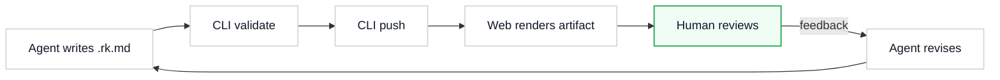

# Diagram Visual Language Fixture

Minimal artifact exercising the RenderKit diagram visual vocabulary: semantic shapes, arrow colors, and theme alignment.

:::summary{id="fixture-summary" title="Fixture purpose"}
This fixture validates that an agent can author a `:::diagram` block using the shape and arrow conventions from `docs/renderkit-diagram-visual-language.md`.
:::

:::diagram{id="svg-visual-language" engine="svg" caption="Agent Reasoning Loop — paper-light style"}
```svg
<svg viewBox="0 0 720 320" xmlns="http://www.w3.org/2000/svg" role="img" aria-label="Agent reasoning loop diagram">
  <style>
    text { font-family: system-ui, sans-serif; }
  </style>

  <!-- Legend -->
  <rect x="540" y="10" width="170" height="100" rx="6" fill="#f9fafb" stroke="#e5e7eb"/>
  <text x="555" y="30" font-size="11" font-weight="600" fill="#111827">Arrow Legend</text>
  <line x1="555" y1="42" x2="590" y2="42" stroke="#2563eb" stroke-width="2"/>
  <text x="596" y="46" font-size="10" fill="#6b7280">Primary flow</text>
  <line x1="555" y1="58" x2="590" y2="58" stroke="#ea580c" stroke-width="1.5"/>
  <text x="596" y="62" font-size="10" fill="#6b7280">Control/trigger</text>
  <line x1="555" y1="74" x2="590" y2="74" stroke="#059669" stroke-width="1.5" stroke-dasharray="5,3"/>
  <text x="596" y="78" font-size="10" fill="#6b7280">Memory write</text>
  <line x1="555" y1="90" x2="590" y2="90" stroke="#7c3aed" stroke-width="1.5"/>
  <text x="596" y="94" font-size="10" fill="#6b7280">Feedback loop</text>

  <!-- Arrow markers -->
  <defs>
    <marker id="a-blue" markerWidth="10" markerHeight="7" refX="9" refY="3.5" orient="auto">
      <polygon points="0 0, 10 3.5, 0 7" fill="#2563eb"/>
    </marker>
    <marker id="a-orange" markerWidth="10" markerHeight="7" refX="9" refY="3.5" orient="auto">
      <polygon points="0 0, 10 3.5, 0 7" fill="#ea580c"/>
    </marker>
    <marker id="a-green" markerWidth="10" markerHeight="7" refX="9" refY="3.5" orient="auto">
      <polygon points="0 0, 10 3.5, 0 7" fill="#059669"/>
    </marker>
    <marker id="a-purple" markerWidth="10" markerHeight="7" refX="9" refY="3.5" orient="auto">
      <polygon points="0 0, 10 3.5, 0 7" fill="#7c3aed"/>
    </marker>
  </defs>

  <!-- Node: User (rounded rect, green tint) -->
  <rect x="30" y="30" width="120" height="50" rx="12" fill="#f0fdf4" stroke="#16a34a" stroke-width="1.5"/>
  <text x="90" y="60" text-anchor="middle" font-size="14" fill="#111827">User</text>

  <!-- Node: Agent (hexagon, blue tint) -->
  <polygon points="215,15 305,15 330,40 305,65 215,65 190,40"
           fill="#eff6ff" stroke="#2563eb" stroke-width="1.5"/>
  <text x="260" y="45" text-anchor="middle" font-size="14" fill="#111827">Agent</text>

  <!-- Node: LLM (rounded rect, blue bg) -->
  <rect x="210" y="120" width="120" height="50" rx="8" fill="#eff6ff" stroke="#2563eb" stroke-width="1.5"/>
  <text x="270" y="150" text-anchor="middle" font-size="14" fill="#111827">LLM</text>

  <!-- Node: Tool (rounded rect, orange tint) -->
  <rect x="400" y="120" width="120" height="50" rx="4" fill="#fff7ed" stroke="#ea580c" stroke-width="1.5"/>
  <text x="460" y="150" text-anchor="middle" font-size="14" fill="#111827">Tool</text>

  <!-- Node: Memory (dashed rect) -->
  <rect x="210" y="230" width="120" height="50" rx="8" fill="#ffffff" stroke="#059669"
        stroke-width="1.5" stroke-dasharray="6,3"/>
  <text x="270" y="260" text-anchor="middle" font-size="14" fill="#111827">Memory</text>

  <!-- Node: Decision (diamond) -->
  <polygon points="460,220 510,250 460,280 410,250"
           fill="#faf5ff" stroke="#7c3aed" stroke-width="1.5"/>
  <text x="460" y="254" text-anchor="middle" font-size="11" fill="#111827">Done?</text>

  <!-- Arrows -->
  <!-- User → Agent (primary) -->
  <line x1="150" y1="55" x2="190" y2="40" stroke="#2563eb" stroke-width="2" marker-end="url(#a-blue)"/>

  <!-- Agent → LLM (control) -->
  <line x1="260" y1="65" x2="268" y2="120" stroke="#ea580c" stroke-width="1.5" marker-end="url(#a-orange)"/>

  <!-- LLM → Tool (control) -->
  <line x1="330" y1="145" x2="400" y2="145" stroke="#ea580c" stroke-width="1.5" marker-end="url(#a-orange)"/>

  <!-- Tool → Memory (memory write) -->
  <line x1="460" y1="170" x2="330" y2="240" stroke="#059669" stroke-width="1.5"
        stroke-dasharray="5,3" marker-end="url(#a-green)"/>

  <!-- LLM → Decision (primary) -->
  <line x1="330" y1="155" x2="420" y2="240" stroke="#2563eb" stroke-width="2" marker-end="url(#a-blue)"/>

  <!-- Decision → Agent feedback (purple loop) -->
  <path d="M 510,250 C 560,250 560,40 330,40"
        fill="none" stroke="#7c3aed" stroke-width="1.5" marker-end="url(#a-purple)"/>
</svg>
```
:::

:::diagram{id="mermaid-styled-flow" engine="mermaid" caption="RenderKit pipeline — Mermaid with shape vocabulary"}

:::

:::callout{id="vocab-note" tone="info" title="Vocabulary applied"}
Both diagrams above use the paper-light style preset. The SVG diagram exercises five shape types (User rounded-rect, Agent hexagon, LLM/Tool/Process rects, Memory dashed rect, Decision diamond) and four arrow semantics (primary blue, control orange, memory-write green dashed, feedback purple curved). The Mermaid diagram uses process and user class styles.
:::
