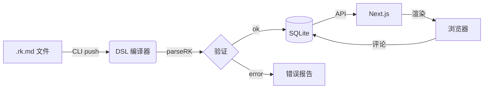
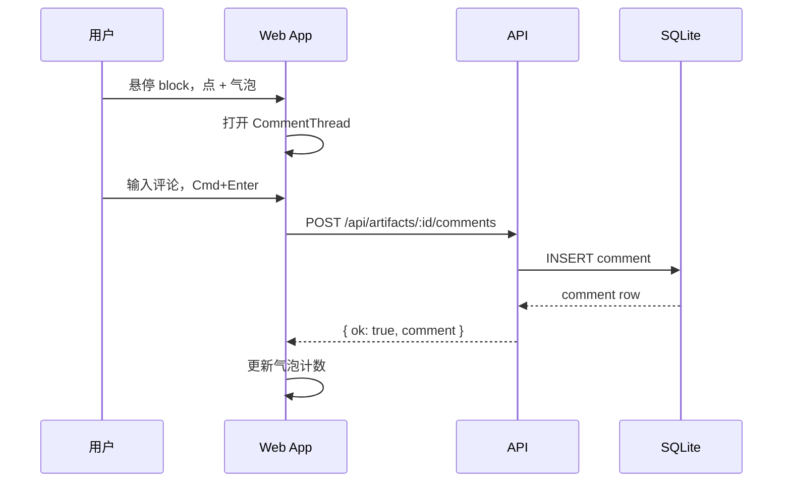

# RenderKit 全能力展示

这是一份 **完整的能力展示文档**，覆盖 RenderKit 支持的全部 block 类型。每个 block 都使用了 rich text、主题色、响应式布局。可以通过右侧气泡留评论。

---

## 文本与排版

### 富文本内联语法

这段话展示了所有内联语法：**粗体**、*斜体*、`行内代码`、[超链接](https://github.com/lobehub)、~~删除线~~。无需任何额外配置，RichText 解析器自动处理。

普通段落：每行最大 72 字符宽度，行高 1.75，阅读体验接近 Notion / Linear 文档标准。

---

## Callout 提示框（7 种语义）

:::callout{tone=info}
**背景**：RenderKit 使用 `lucide-react` 图标库（lobehub、shadcn/ui 同款），所有 callout 图标都是 24px stroke 矢量图，dark mode 自动适配。
:::

:::callout{tone=warning title=注意事项}
这是 **warning** 警告框。适合标注边界条件、潜在风险、迁移注意事项。
:::

:::callout{tone=danger title=禁止操作}
**绝对不要**在生产环境直接删除数据库表。不可逆操作使用 danger 级别。
:::

:::callout{tone=success title=已完成}
API v2 已完成全量灰度，p99 延迟降低 **40%**，错误率从 0.8% 降至 *0.12%*。
:::

:::callout{tone=tip title=最佳实践}
使用 `pnpm verify:contracts` 做 CI 漂移检测，而不是写 E2E 测试。快 10 倍，且对 AI agent 友好。
:::

:::callout{tone=decision title=架构决策}
选择 **SQLite + better-sqlite3** 作为本地存储方案。原因：零配置、性能足够、单文件备份、无需 Docker。
:::

:::callout{tone=note}
这是补充说明类 callout，用于 FYI 信息、背景知识、非必读内容。
:::

---

## 统计 / KPI 卡片

:::grid{cols=4}
:::stat{label="月活用户" value="128,400" unit="人" delta="+12%" deltaDir=up tone=positive}
:::

:::stat{label="API 延迟 p99" value="82" unit="ms" delta="-18ms" deltaDir=down tone=positive}
:::

:::stat{label="错误率" value="0.12" unit="%" delta="+0.04%" deltaDir=up tone=negative}
:::

:::stat{label="部署频率" value="4.2" unit="次/天" delta="持平" deltaDir=neutral}
:::
:::

---

## 数据图表（ECharts）

:::chart{id="mau-bar" type=bar title="月活用户趋势（万人）" caption="数据来源：产品 Analytics，2026 Q1"}
| 月份 | 用户数 |
|------|--------|
| 1月  | 8.2    |
| 2月  | 9.1    |
| 3月  | 10.4   |
| 4月  | 11.8   |
| 5月  | 12.84  |
:::

:::grid{cols=2}
:::chart{id="channel-pie" type=pie title="流量来源分布"}
| 来源     | 占比 |
|----------|------|
| 直接访问 | 38   |
| 搜索引擎 | 29   |
| 社交媒体 | 18   |
| 推荐链接 | 15   |
:::

:::chart{id="latency-line" type=line title="API 延迟趋势（ms）"}
| 周次 | p50 |
|------|-----|
| W1   | 45  |
| W2   | 52  |
| W3   | 38  |
| W4   | 41  |
| W5   | 35  |
:::
:::

:::chart{id="kpi-overview" type=kpi title="核心业务指标一览"}
| 指标       | 值     | 变化   |
|------------|--------|--------|
| 月活用户   | 128.4K | +12%   |
| 付费转化率 | 8.3%   | +1.2%  |
| NPS 评分   | 67     | +5     |
| 服务可用性 | 99.97% | 持平   |
:::

---

## 数据表格（5 种 Profile）

### Matrix（默认对比表）

:::table{id="t-matrix" profile=matrix}
| 方案       | 性能   | 成本  | 复杂度 | 可维护性 |
|------------|--------|-------|--------|----------|
| SQLite     | ★★★★   | 免费  | 低     | 高       |
| PostgreSQL | ★★★★★  | 中    | 中     | 高       |
| MongoDB    | ★★★    | 中    | 中     | 中       |
| DynamoDB   | ★★★★★  | 高    | 高     | 低       |
:::

### Status（状态监控表）

:::table{id="t-status" profile=status}
| 服务         | 状态      | 延迟   | 最后检查  |
|--------------|-----------|--------|-----------|
| API Gateway  | healthy   | 12ms   | 2min ago  |
| Auth Service | healthy   | 8ms    | 2min ago  |
| DB Primary   | degraded  | 145ms  | 1min ago  |
| Cache Redis  | healthy   | 2ms    | 2min ago  |
| CDN Edge     | critical  | —      | 5min ago  |
:::

### Key-Value（配置表）

:::table{id="t-kv" profile=key-value}
| 配置项           | 值                      |
|------------------|-------------------------|
| Node 版本        | v24.12.0                |
| 包管理器         | pnpm 9.x                |
| 框架             | Next.js 15.3            |
| 数据库           | SQLite (better-sqlite3) |
| 代码高亮         | Shiki + hljs fallback   |
| 图表             | ECharts 5.5             |
:::

---

## 代码块

:::code{id="code-ts" lang=typescript title="RenderKit DSL 解析" frame=editor filename="parse.ts" showLineNumbers=true}
```typescript
import { parseRK } from '@renderkit/dsl';

const result = parseRK(`
:::callout{tone=success}
**已完成** — 类型安全的 DSL 编译链。
:::
`);

if (result.ok && result.model) {
  console.log(`解析成功，共 ${result.model.blocks.length} 个 block`);
  result.model.blocks.forEach(block => {
    console.log(`  [${block.type}] ${block.id}`);
  });
}
```
:::

:::code{id="code-bash" lang=bash title="本地开发" frame=terminal}
```bash
# 安装依赖
pnpm install

# 启动 dev server
pnpm dev

# 推送 artifact
pnpm renderkit push examples/capabilities/full-showcase.rk.md --open

# CI 门控
pnpm verify:contracts
```
:::

---

## 流程图（Mermaid）

:::diagram{id="arch-flow" engine=mermaid title="RenderKit 数据流"}

:::

:::diagram{id="seq-comment" engine=mermaid title="评论提交流程"}

:::

---

## 方案对比

:::comparison{id="cmp-sqlite" variant=proscons}
| ✓ 优点                          | ✗ 缺点                       |
|--------------------------------|------------------------------|
| 零配置，单文件                  | 不支持多写入并发              |
| 性能优秀（10万行以内）          | 无内置全文搜索               |
| 无需 Docker                    | 迁移到 Postgres 需改造        |
| 事务 ACID 完整支持              | 不适合超大数据集              |
:::

---

## 时间线 / 步骤

:::timeline{id="tl-roadmap" title="RenderKit 发布计划"}
- label: "TypeScript 全量迁移"
  status: done
  body: "删除所有 .mjs/.jsx/.js，packages 全部 strict: true，Node 24 strip-types 直跑。"
  tags: [infrastructure, "Q1 2026"]
- label: "ArtifactView 飞书模型重构"
  status: done
  body: "删掉 10 个组件 + 5 个 hooks，实现气泡评论 + 悬浮 CommentThread。"
  tags: [UX, product]
- label: "Block 渲染质量提升"
  status: active
  body: "接入 lucide-react，RichText 解析器，ECharts 图表，md2html 参考 CSS。"
  tags: [rendering, "进行中"]
- label: "Infographic SVG 增强"
  status: next
  body: "参考 fireworks-tech-graph，支持架构图生成，增强 chart 模板。"
  tags: [charts, "Q2 2026"]
- label: "多人协作 & Agent 评论飞轮"
  status: next
  body: "评论 → CLI feedback → Agent 读取并响应，形成 human-agent 协作闭环。"
  tags: [agent, collaboration]
:::

---

## 决策记录（ADR）

:::decision-card{id="adr-sqlite"}
question: 本地存储选型：SQLite vs PostgreSQL vs 文件系统
chosen: SQLite (better-sqlite3)
status: decided

rationale:
- 本地优先场景，单机写入足够
- 零配置，无需 Docker
- single binary 部署，单文件备份

alternatives:
- PostgreSQL（复杂度高，需 Docker）
- 纯 JSON 文件（并发写入有风险）
:::

---

## 检查清单

:::checklist{id="cl-launch" title="发布前检查清单"}
- text: "pnpm verify:contracts 通过（72/72）"
  checked: true
- text: "所有 .mjs/.jsx/.js 已删除"
  checked: true
- text: "TypeScript strict: true 全包开启"
  checked: true
- text: "ArtifactView 飞书模型完成"
  checked: true
- text: "ECharts 图表接通"
  checked: true
- text: "Lucide icons 替换 inline SVG"
  checked: true
- text: "Dead CSS 清理（旧 review-mode）"
  checked: false
  note: "待做"
- text: "Infographic SVG 增强"
  checked: false
  note: "下一阶段"
:::

---

## 引语

:::quote{id="q-karpathy"}
The hottest new programming language is English.
:::

:::quote{id="q-knuth" attribution="Donald Knuth" source="The Art of Computer Programming"}
Premature optimization is the root of all evil.
:::

---

## 文档摘要

:::summary{id="sum-main" title="本文档要点"}
覆盖 RenderKit 全部 block 类型：callout（7种语义）、stat（KPI卡）、chart（ECharts bar/line/pie/kpi）、table（5种profile）、code（editor/terminal frame）、diagram（Mermaid）、comparison（proscons）、timeline（步骤卡）、decision（ADR）、checklist、quote、summary、grid、tabs。所有文本字段支持 **bold**、*italic*、`code`、[link](url) 内联语法。
:::

---

## 标签页

:::::tabs{id="tabs-stack" title="技术栈"}
::::tab{id="frontend" label="前端"}
:::table{id="t-fe" profile=key-value}
| 层       | 技术              |
|----------|-------------------|
| 框架     | Next.js 15        |
| 渲染     | React 19          |
| 图标     | lucide-react      |
| 图表     | ECharts 5         |
| 代码高亮 | Shiki + hljs      |
:::
::::

::::tab{id="backend" label="后端"}
:::table{id="t-be" profile=key-value}
| 层       | 技术              |
|----------|-------------------|
| 运行时   | Node 24           |
| 框架     | Next.js API       |
| 数据库   | SQLite            |
| ORM      | better-sqlite3    |
| CLI      | Commander.js      |
:::
::::
:::::

---

## 网格布局

:::grid{cols=3}
:::callout{tone=info title=并发}
Grid 支持 2/3/4 列，每格可放任意 block 类型。
:::

:::callout{tone=tip title=响应式}
移动端自动折叠为单列，无需媒体查询。
:::

:::callout{tone=success title=嵌套}
Grid 内可嵌套 callout、stat、table、code 等任意块。
:::
:::
