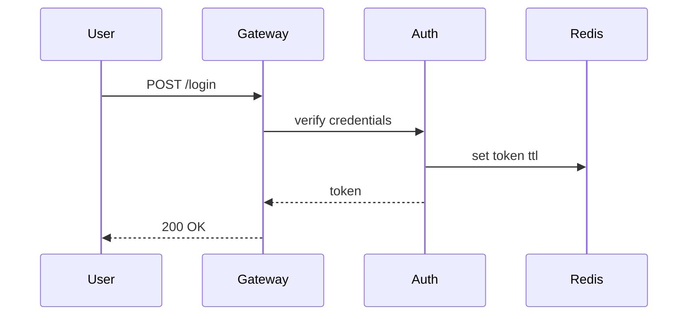

# 认证模块重构方案

这是一份 RenderKit 本地试跑文档。普通段落会被渲染为 paragraph block，但暂时不作为评论重点。

:::callout{id="risk-token" tone="warning" title="Token 风险"}
JWT secret 需要轮换，否则长期泄漏风险较高。
:::

:::decision-card{id="auth-decision"}
question: 认证方式选择
chosen: JWT + Redis
status: approved

rationale:
  - 无状态
  - 水平扩展友好
  - 网关层集成简单

alternatives:
  - name: Session
    reason: 有状态，不适合多实例扩展
  - name: OAuth2
    reason: 当前场景过重
:::

:::diagram{id="login-flow" engine="mermaid" caption="登录链路"}

:::
