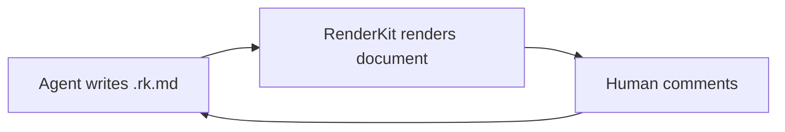

# Documentation Surface Example

:::sum{id="documentation-summary" title="Reader promise"}
Use the documentation surface for blog/Notion-style explanatory artifacts: prose-forward, visually calm, and commentable without making metadata the main event.
:::

:::quote{id="documentation-principle" cite="RenderKit authoring principle" role="Agent-to-UI"}
The artifact should make the next decision obvious before the reader opens raw source.
:::

:::fig{id="documentation-flow" caption="Documentation loop"}

:::

:::table{id="documentation-checks" title="Documentation quality checks"}
| Check | Why it matters |
|---|---|
| Short paragraphs | Keeps blog-style reading rhythm |
| Captions | Makes diagrams and images reviewable |
| Stable block ids | Preserves comment anchors |
:::

:::::tabs{id="documentation-tabs" title="Reader and reviewer modes"}
::::tab{id="documentation-reader" label="Reader"}
:::note{id="documentation-reader-note" title="Reading-first"}
Default mode should feel like one finished document.
:::
::::
::::tab{id="documentation-reviewer" label="Reviewer"}
:::note{id="documentation-reviewer-note" title="Review when needed"}
Comments and metadata are available, but stay secondary to the document body.
:::
::::
:::::
