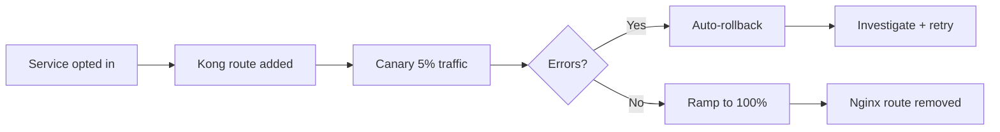

# API Gateway Migration Plan

This plan covers the migration from the legacy Nginx reverse proxy to a Kong-based API gateway. Target: Q3 2026.

:::summary{id="exec-summary" title="Executive Summary"}
Migrate 42 upstream services from Nginx to Kong Gateway. Key outcomes: centralized rate limiting, JWT validation at the gateway layer, and observable request tracing. Risk is mitigated by a per-service canary rollout with automatic rollback. Estimated effort: 4 engineering weeks.
:::

:::decision-card{id="gateway-choice"}
question: Which API gateway?
chosen: Kong
status: approved

rationale:
  - Mature plugin ecosystem (rate limiting, JWT, tracing)
  - Declarative configuration via YAML
  - Teams already familiar with Kong from side projects

alternatives:
  - name: Traefik
    reason: Good auto-discovery but weaker plugin ecosystem for our use case
  - name: Envoy + custom control plane
    reason: Maximum flexibility but 2-3x implementation cost
:::

:::callout{id="risk-dns" tone="warning" title="DNS Cutover Risk"}
DNS TTL is 300s on the primary zone. During cutover, up to 5 minutes of split traffic is possible. Plan a maintenance window and announce in #infra.
:::

:::code{id="kong-config" language="yaml" title="Kong Declarative Config (excerpt)"}
```yaml
_format_version: "3.0"
_services:
  - name: auth-service
    url: http://auth.internal:8080
    routes:
      - name: auth-route
        paths:
          - /api/auth
    plugins:
      - name: rate-limiting
        config:
          minute: 60
          policy: local
      - name: jwt
        config:
          uri_param_names:
            - jwt
```
:::

:::diagram{id="migration-flow" engine="mermaid" caption="Migration Rollout Flow"}

:::

:::callout{id="open-q" tone="info" title="Open Questions"}
1. Should we enforce mTLS between gateway and upstreams? Decision pending infra team review.
2. WebSocket support timeline — Kong supports it but plugin compatibility is untested.
:::
