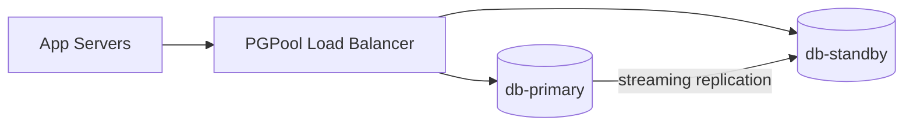

# Database Failover Runbook

:::summary{id="runbook-summary" title="Purpose"}
Step-by-step procedure for failing over the primary PostgreSQL database to the standby replica. Use this runbook when the primary is unresponsive, corrupted, or under maintenance. Expected downtime: 30-90 seconds.
:::

:::callout{id="prereqs" tone="warning" title="Prerequisites"}
- VPN connected to `prod-vpn`
- `psql` client installed
- SSH access to `db-primary.internal` and `db-standby.internal`
- PagerDuty incident created
:::

:::callout{id="rollback-note" tone="danger" title="Rollback"}
If failover fails at any step, run the rollback section at the bottom. Do NOT skip steps or proceed past a failed health check.
:::

:::diagram{id="failover-topology" engine="mermaid" caption="Database Topology"}

:::

## Step 1: Verify Standby Health

:::code{id="check-standby" language="bash" title="Check standby replication lag"}
```bash
ssh db-standby.internal
psql -U postgres -c "SELECT now() - pg_last_xact_replay_timestamp() AS replication_lag;"
# Expected: < 5 seconds
# If > 30 seconds, DO NOT proceed — investigate replication first
```
:::

## Step 2: Stop Application Writes

:::code{id="stop-writes" language="bash" title="Enable maintenance mode"}
```bash
ssh app-server-01.internal
curl -X PUT http://localhost:8080/admin/maintenance \
  -H "Authorization: Bearer $ADMIN_TOKEN" \
  -d '{"enabled": true, "message": "Database failover in progress"}'
# Verify: curl http://localhost:8080/health should return 503
```
:::

## Step 3: Promote Standby

:::code{id="promote" language="bash" title="Promote standby to primary"}
```bash
ssh db-standby.internal
sudo -u postgres pg_ctl promote -D /var/lib/postgresql/16/main
# Verify promotion:
psql -U postgres -c "SELECT pg_is_in_recovery();"
# Expected: f (false = primary mode)
```
:::

## Step 4: Update Load Balancer

:::code{id="update-lb" language="bash" title="Point PGPool to new primary"}
```bash
ssh pglb.internal
# Edit /etc/pgpool2/pgpool.conf
# Set backend_hostname0 = 'db-standby.internal'
# Set backend_status0 = 1 (up)
sudo systemctl reload pgpool2
```
:::

## Step 5: Disable Maintenance Mode

:::code{id="enable-writes" language="bash" title="Disable maintenance mode"}
```bash
ssh app-server-01.internal
curl -X PUT http://localhost:8080/admin/maintenance \
  -H "Authorization: Bearer $ADMIN_TOKEN" \
  -d '{"enabled": false}'
# Verify: curl http://localhost:8080/health should return 200
```
:::

## Rollback

:::callout{id="rollback" tone="danger" title="Rollback Procedure"}
1. Re-enable maintenance mode (Step 2 command with `enabled: true`).
2. On the old primary: `sudo -u postgres pg_ctl start -D /var/lib/postgresql/16/main`.
3. Reconfigure PGPool to point back to `db-primary.internal`.
4. Reload PGPool, disable maintenance mode.
5. If old primary data is corrupted, restore from latest PITR snapshot before proceeding.
:::
