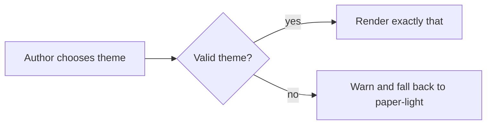

# Dark Pro Opt-in Developer Case

Dark Pro is not the default. This case exists to keep the optional dark theme readable and sober.

:::summary{id="dark-summary" title="Dark mode contract"}
Dark mode must avoid neon gradients and low-contrast chrome. Body text, rail labels, source excerpts, code, and status pills must stay readable.
:::

:::callout{width="half" id="dark-danger" tone="danger" title="Known failure mode"}
If the page looks like an AI-generated dark dashboard, the theme has failed. Keep it quiet: dark slate, clear text, restrained accent.
:::

:::decision-card{id="dark-decision"}
question: Should dark-pro be the default?
chosen: no
status: approved

rationale:
  - User feedback says the black default looked ugly and AI-generated
  - Normal documents are expected to be white
  - Dark mode remains useful as an explicit preference

alternatives:
  - name: paper-light
    reason: Default and recommended for normal documents
:::

:::code{id="dark-code" language="bash" title="Explicit dark opt-in"}
```bash
renderkit push examples/theme-cases/dark-pro-dev.rk.md --open
```
:::

:::diagram{id="dark-flow" engine="mermaid" caption="Explicit theme selection"}

:::
