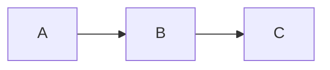

# RenderKit Authoring Skill

## When to use RenderKit

Use RenderKit when you need to produce a structured, reviewable artifact that a human will comment on — not a plain Markdown file. Typical use cases:

- Engineering plans and refactoring proposals
- Decision briefs with alternatives analysis
- Review reports and audit findings
- Runbooks and operational procedures
- Lightweight data/summary reports

Do NOT use RenderKit for:
- Casual notes, chat responses, or inline documentation
- Files the human will directly edit (RenderKit artifacts are Agent-authored, human-reviewed)

## File format: `.rk.md`

RenderKit uses a Markdown-based DSL with frontmatter and directive blocks.

### Frontmatter

```yaml
---
title: Your Artifact Title
theme: paper-light       # paper-light | editorial-kami | dark-pro | amber-terminal
surface: engineering-plan # engineering-plan | decision-brief | review-report | runbook | data-report-lite
---
```

- `title` is required.
- `theme` controls visual appearance. Default: `paper-light`.
- `surface` hints at artifact layout/density. Optional but recommended.

### Ordinary Markdown

Standard Markdown headings (`#`, `##`, `###`) and paragraphs are automatically converted to `heading` and `paragraph` blocks. Their IDs are auto-generated (`heading-1`, `paragraph-1`).

### Directive blocks

All directive blocks require a stable `id`. The `id` must match `[a-zA-Z0-9_-]+` and must be unique within the artifact. **Never change an existing block id** — it is the anchor for human comments. If you need to restructure, delete the old block and create a new one with a new id.

#### summary

```md
:::summary{id="exec-summary" title="Executive Summary"}
Your summary text here. Keep it dense and actionable.
:::
```

#### callout

```md
:::callout{id="risk-note" tone="warning" title="Risk Alert"}
Callout content. Tones: info | warning | danger | success.
:::
```

#### decision-card

```md
:::decision-card{id="auth-choice"}
question: Which auth mechanism?
chosen: JWT + Redis
status: proposed

rationale:
  - Stateless
  - Horizontally scalable

alternatives:
  - name: Session
    reason: Stateful, hard to scale
  - name: OAuth2
    reason: Overkill for current scope
:::
```

Body is YAML. Required fields: `question`, `chosen`. Optional: `status` (draft|proposed|approved|blocked), `rationale` (list), `alternatives` (list of objects with `name` and `reason`).

#### code

````md
:::code{id="example-code" language="js" title="Example"}
```js
console.log("hello renderkit");
```
:::
````

Must contain a fenced code block. `language` and `title` are optional attributes.

#### diagram

````md
:::diagram{id="flow" engine="mermaid" caption="Process Flow"}

:::
````

Supported engines: `mermaid`, `svg`, `echarts`, `infographic`, `plantuml`, `d2`.

- `mermaid`, `svg`, `echarts`, and `infographic` render locally in the browser.
- `plantuml` and `d2` preserve source with a clear fallback until optional local adapters are installed.
- Always include a fenced code block whose language matches the engine when possible.

#### grid

Use `grid` when a document needs two-dimensional layout instead of one block per row.

````md
::::grid{id="kpi-grid" columns="3" title="KPI grid"}
:::summary{id="metric-a" title="Velocity"}
12 shipped artifacts this week.
:::

:::callout{id="metric-b" tone="success" title="Quality"}
128 verifier checks are passing.
:::
::::
````

Grid children are ordinary RenderKit blocks. Keep grids shallow; do not nest a grid inside another grid.

## Stable ID rules

- Every directive block MUST have an `id`.
- IDs must be `[a-zA-Z0-9_-]+`.
- IDs must be unique within the artifact.
- **Do not rename existing IDs** when revising. Comments anchor to IDs.
- If you delete a block, open comments on it become "orphaned" — that is acceptable.

### Auto-generated IDs (headings, paragraphs)

Headings and paragraphs get auto-generated IDs (`heading-1`, `heading-2`, `paragraph-1`, etc.). These IDs are **not stable** — they shift when the document structure changes (e.g. adding/removing a heading renumbers all subsequent headings). **Directive block IDs are stable; auto-generated IDs are not.** Avoid relying on auto-generated IDs for durable comment anchors if the document structure may change.

## CLI workflow

> **Alpha note:** RenderKit is not globally installed. Use the local source command:
>
> ```bash
> node packages/cli/bin/renderkit.mjs <command> [options]
> ```
>
> The commands below show both forms. Use whichever applies to your setup.

```bash
# 1. Validate (always validate before push)
renderkit validate <file>.rk.md --json
# or locally:
node packages/cli/bin/renderkit.mjs validate <file>.rk.md --json

# 2. Push (creates artifact or new revision)
renderkit push <file>.rk.md --open --json
# or locally:
node packages/cli/bin/renderkit.mjs push <file>.rk.md --open --json

# 3. Check status
renderkit status <file>.rk.md --json
# or locally:
node packages/cli/bin/renderkit.mjs status <file>.rk.md --json

# 4. Pull human feedback
renderkit feedback <file>.rk.md --json
# or locally:
node packages/cli/bin/renderkit.mjs feedback <file>.rk.md --json
```

## Feedback revision loop

1. Run `renderkit feedback <file>.rk.md --json`.
2. For each open comment, use the `sourceRange` and `sourceExcerpt` to locate the relevant block in the `.rk.md` file.
3. Edit the `.rk.md` source to address the feedback.
4. Re-run `renderkit validate` to ensure no errors.
5. Run `renderkit push <file>.rk.md --json` to create a new revision.
6. Optionally pass `--resolve cmt_id1,cmt_id2` to mark comments as resolved.

## Theme guide

| Theme | When to use |
|-------|------------|
| `paper-light` | Default. Normal documents, engineering plans, decision briefs, review reports. |
| `editorial-kami` | Long-form editorial/documentation artifacts with a warm paper feel. |
| `dark-pro` | Optional dark mode for demos or developer preference; do not use as default. |
| `paper-light` | Long-form reports, proposals that may be screenshotted. |
| `amber-terminal` | For users with amber/yellow terminal aesthetic. Avoids black-on-black readability issues. |

If an unsupported `theme` value is used, validation emits warning `RK_THEME_UNKNOWN` and falls back to `paper-light`.

## Surface guide

| Surface | Recommended blocks |
|---------|-------------------|
| `engineering-plan` | summary, callout, decision-card, code, diagram, grid, subdocument |
| `decision-brief` | summary, decision-card, callout |
| `review-report` | summary, callout, code |
| `runbook` | summary, code, callout, diagram |
| `data-report-lite` | summary, code, diagram, grid |

If an unsupported `surface` value is used, validation emits warning `RK_SURFACE_UNKNOWN`. The value passes through but may not render as expected.

## Recipes

Each surface has a **recipe** in `packages/shared/src/index.mjs` (`RECIPES` export) with:
- `recommendedTheme` — best-fit theme for the surface
- `recommendedBlocks` — blocks that should appear in most artifacts of this surface
- `structure` — ordered guidance for document structure
- `antiPatterns` — common mistakes to avoid

When authoring, consult the recipe for the target surface. Do not improvise structure; follow the recipe's recommended order and block choices.

## Example gallery

Canonical examples for each surface live in `examples/surfaces/`:

| File | Surface | Theme |
|------|---------|-------|
| `examples/surfaces/engineering-plan.rk.md` | engineering-plan | paper-light |
| `examples/surfaces/decision-brief.rk.md` | decision-brief | paper-light |
| `examples/surfaces/review-report.rk.md` | review-report | paper-light |
| `examples/surfaces/runbook.rk.md` | runbook | amber-terminal |
| `examples/surfaces/data-report-lite.rk.md` | data-report-lite | paper-light |

An index of all gallery entries is at `examples/gallery.json`. The web app serves a `/gallery` page listing all surfaces.

When in doubt about how a surface should look, read the corresponding example file.

## Error codes

| Code | Fix |
|------|-----|
| `RK_UNKNOWN_BLOCK_TYPE` | Use a known block type: callout, decision-card, diagram, code, summary, subdocument, grid |
| `RK_BLOCK_ID_REQUIRED` | Add `id="..."` attribute to the directive |
| `RK_BLOCK_ID_INVALID` | Use only `[a-zA-Z0-9_-]+` characters in the id |
| `RK_DUPLICATE_BLOCK_ID` | Each block id must be unique |
| `RK_FRONTMATTER_INVALID` | Fix YAML syntax in frontmatter |
| `RK_DECISION_YAML_INVALID` | Fix YAML syntax in decision-card body |
| `RK_PROP_REQUIRED` | Add required fields (e.g. question, chosen for decision-card) |
| `RK_DIAGRAM_CODE_REQUIRED` | Add a fenced code block inside diagram |
| `RK_UNSUPPORTED_DIAGRAM_ENGINE` | Use one of: mermaid, svg, echarts, infographic, plantuml, d2 |
| `RK_CODE_BODY_REQUIRED` | Add a fenced code block inside code directive |
| `RK_THEME_UNKNOWN` | (warning) Use a supported theme: paper-light, editorial-kami, dark-pro, amber-terminal. Falls back to paper-light. |
| `RK_SURFACE_UNKNOWN` | (warning) Use a supported surface: engineering-plan, decision-brief, review-report, runbook, data-report-lite. |
