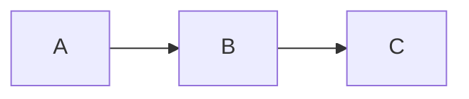

# RenderKit Authoring Skill

## When to use RenderKit

Use RenderKit when you need to produce a structured, reviewable artifact that a human will comment on — not a plain Markdown file. Typical use cases:

- Engineering plans and refactoring proposals
- Decision briefs with alternatives analysis
- Review reports and audit findings
- Runbooks and operational procedures
- Lightweight data/summary reports

Do NOT use RenderKit for:
- Casual notes, chat responses, or inline documentation
- Files the human will directly edit (RenderKit artifacts are Agent-authored, human-reviewed)

## Design-quality directives

These directives are adapted from the cloned `html-anything` design assets and are mandatory for RenderKit authoring. RenderKit is not prompt-only HTML generation, but the anti-slop design rules still apply.

1. **Content determines structure.** Do not force a fixed number of blocks. Split by actual semantic units: decision, risk, metric, code, diagram, comparison, timeline, checklist.
2. **Do not compress away user content.** Cover every important requirement, data group, risk, decision, and action item. Use more blocks rather than stuffing unrelated ideas into one paragraph.
3. **Use real data only.** Never invent metrics, names, dates, incidents, or placeholder text such as lorem ipsum / Your text here.
4. **Reading-first.** The artifact should read like a finished document. Metadata exists for CLI/API feedback, not for the human's primary reading surface.
5. **Visual restraint.** Prefer one primary accent, neutral surfaces, generous whitespace, consistent 8px rhythm, soft borders, and subtle shadows.
6. **Typography discipline.** Keep paragraphs readable; avoid wall-of-text Markdown. Use `summary`, `stat`, `table`, `quote`, `comparison`, `timeline`, `tabs`, and `grid` when they improve scanning.
7. **Accessibility.** Preserve contrast, meaningful headings, alt text for images, captions for diagrams, and clear labels for tables/charts.
8. **No body editing assumption.** Human feedback arrives as comments/selectors. The Agent updates `.rk.md` and pushes a new revision.

## Agent planning CLI

Before authoring a substantial artifact, ask the local CLI for the current recipe and design-resource guidance instead of relying on memory:

```bash
renderkit recipes list --json
renderkit recipes show engineering-plan --json
renderkit surfaces --json
renderkit themes --json
renderkit blocks --json
renderkit aliases --json
renderkit errors --json
renderkit design resources --json
renderkit design resource md2html --json
renderkit design recommend --surface documentation --json
```

Use `renderkit recipes show <surface>` to choose block structure and anti-patterns. Use `renderkit design recommend --surface <surface>` to get a compact, deterministic authoring bundle: theme, blocks, relevant design resources, rules, and validation commands. Use `renderkit design resources` to see the full prioritized local design assets that informed RenderKit; do not copy external runtimes directly into `.rk.md`.

After review, pull comments for the Agent loop:

```bash
renderkit feedback path/to/artifact.rk.md --json
```

## File format: `.rk.md`

RenderKit uses a Markdown-based DSL with frontmatter and directive blocks.

### Frontmatter

```yaml
---
title: Your Artifact Title
theme: paper-light       # paper-light | editorial-kami | dark-pro | amber-terminal
surface: engineering-plan # engineering-plan | decision-brief | review-report | runbook | data-report-lite
---
```

- `title` is required.
- `theme` controls visual appearance. Default: `paper-light`.
- `surface` hints at artifact layout/density. Optional but recommended.

### Ordinary Markdown

Standard Markdown headings (`#`, `##`, `###`) and paragraphs are automatically converted to `heading` and `paragraph` blocks. Their IDs are auto-generated (`heading-1`, `paragraph-1`).

### Directive blocks

Directive block `id` is optional for draft/display-only blocks: RenderKit will generate a deterministic `auto-...` id when omitted. For any block likely to receive review comments, add a stable explicit `id` that matches `[a-zA-Z0-9_-]+` and is unique within the artifact. **Never change an existing explicit block id** — it is the anchor for human comments. If you need to restructure, delete the old block and create a new one with a new id.

### Shorthand aliases

Use aliases for faster Agent authoring. They compile to the canonical block types.

| Alias | Canonical block | Defaults |
|---|---|---|
| `sum` | `summary` | — |
| `note` | `callout` | `tone="info"` |
| `warn` | `callout` | `tone="warning"` |
| `alert` | `callout` | `tone="danger"` |
| `ok` | `callout` | `tone="success"` |
| `dec` | `decision-card` | — |
| `fig` | `diagram` | engine inferred from fence/body; defaults to Mermaid |
| `src` | `code` | — |
| `metric` | `stat` | — |
| `todo` | `checklist` | — |
| `compare` | `comparison` | — |
| `roadmap` | `timeline` | — |

Example:

```md
:::sum{id="exec-summary" title="Executive Summary"}
Your summary text here. Keep it dense and actionable.
:::
```

#### summary

```md
:::summary{id="exec-summary" title="Executive Summary"}
Your summary text here. Keep it dense and actionable.
:::
```

Preferred shorthand:

```md
:::sum{id="exec-summary" title="Executive Summary"}
Your summary text here. Keep it dense and actionable.
:::
```

#### callout

```md
:::callout{id="risk-note" tone="warning" title="Risk Alert"}
Callout content. Tones: info | warning | danger | success.
:::
```

#### decision-card

Full YAML form:

```md
:::decision-card{id="auth-choice"}
question: Which auth mechanism?
chosen: JWT + Redis
status: proposed

rationale:
  - Stateless
  - Horizontally scalable

alternatives:
  - name: Session
    reason: Stateful, hard to scale
:::
```

Shorthand form for simple decisions:

```md
:::dec{id="auth-choice" q="Which auth mechanism?" chosen="JWT + Redis" status="proposed"}
- Stateless
- Horizontally scalable
:::
```

Required fields: `question`/`q`, `chosen`. Optional: `status` (draft|proposed|approved|blocked), `rationale`, `alternatives`.

#### code

````md
:::code{id="example-code" language="js" title="Example"}
```js
console.log("hello renderkit");
```
:::
````

Must contain a fenced code block. `language` and `title` are optional attributes.

#### diagram

Fenced form:

````md
:::fig{id="flow" caption="Process Flow"}

:::
````

Inline Mermaid body form:

```md
:::fig{id="flow" caption="Process Flow"}
flowchart LR
  A --> B --> C
:::
```

Supported engines: `mermaid`, `svg`, `echarts`, `echarts-bar`, `echarts-line`, `echarts-pie`, `infographic`, `plantuml`, `d2`.

- `engine` is optional when the fenced code language is present; RenderKit infers it.
- Without a fence/body engine, RenderKit defaults to Mermaid.
- `echarts` accepts raw ECharts JSON option.
- `echarts-bar`, `echarts-line`, and `echarts-pie` accept CSV-like data so the Agent does not need to write large option JSON:

```md
:::fig{id="latency" engine="echarts-line" caption="Latency trend"}
window,p50,p95
09:00,82,138
10:00,79,142
:::
```

- `mermaid`, `svg`, `echarts*`, and `infographic` render locally in the browser.
- `plantuml` and `d2` render through the local RenderKit server (`/api/render/diagram`). PlantUML requires local Java and may require Graphviz for some diagram types; D2 uses local WASM.

#### stat / metric

Use `stat` or alias `metric` for KPI cards and product-readiness numbers.

```md
:::metric{id="adoption" label="Adoption" value="74%" delta="+18%" tone="success"}
Share of artifacts using visual blocks.
:::
```

#### checklist / todo

Use `checklist` or alias `todo` for readiness gates and review punch lists.

```md
:::todo{id="ship-checklist" title="Readiness checklist"}
- [x] Reading-first layout
- [x] Selection comments
- [ ] Robust re-anchoring
:::
```

#### quote

Use `quote` for blog-style pull quotes, principles, and reviewer callouts.

```md
:::quote{id="principle" cite="RenderKit principle" role="Agent-to-UI"}
The artifact should make the next decision obvious before the reader opens raw source.
:::
```

#### image

Use `image` for architecture snapshots, screenshots, mockups, generated SVGs, and blog-style hero figures.

```md
:::image{id="architecture" src="./architecture.png" alt="System architecture" title="Architecture" aspect="16:9" width="wide"}
Optional caption text.
:::
```

Supported attributes: `src` (required), `alt`, `title`, `caption`, `aspect` (`16:9`, `4:3`, `1:1`), `width`.

#### table

Use `table` for comparison matrices, status trackers, release gates, and review findings.

```md
:::table{id="risk-table" title="Risk matrix" width="wide"}
| Area | Current signal | Decision impact | Owner |
|---|---|---|---|
| Queue latency | p95 142ms | Continue rollout | SRE |
| Rollback | Config-only tested | Safe to proceed | Release |
:::
```

#### tabs

Use `tabs` to keep a technical document dense without making the reader scroll through every branch. Good uses: Reader/Reviewer views, Before/After, Option A/B/C, platform-specific instructions.

````md
:::::tabs{id="delivery-tabs" title="Delivery views" width="wide"}
::::tab{id="reader" label="Reader view"}
:::note{id="reader-note" title="Reader-first"}
Default view should read like a finished document.
:::
::::

::::tab{id="reviewer" label="Reviewer view"}
:::src{id="feedback-command" language="bash" title="Feedback"}
```bash
renderkit feedback plan.rk.md --json
```
:::
::::
:::::
````

Keep tabs shallow. Each tab should contain a few RenderKit blocks, not a whole separate document.

#### grid

Use `grid` when a document needs two-dimensional layout instead of one block per row.

````md
::::grid{id="kpi-grid" columns="3" title="KPI grid"}
:::summary{id="metric-a" title="Velocity"}
12 shipped artifacts this week.
:::

:::callout{id="metric-b" tone="success" title="Quality"}
128 verifier checks are passing.
:::
::::
````

Grid children are ordinary RenderKit blocks. Keep grids shallow; do not nest a grid inside another grid.

#### comparison / compare

Use `comparison` or alias `compare` for side-by-side evaluation of options, alternatives, or trade-offs.

```md
:::compare{id="auth-comparison" title="Auth mechanism comparison" width="wide"}
| Criterion | JWT + Redis | Session | mTLS |
|---|---|---|---|
| Scalability | Stateless | Stateful | Stateless |
| Complexity | Medium | Low | High |
| Best for | API-first | Server-rendered | Service mesh |
:::
```

The body must be a GitHub-flavored Markdown table with at least two columns and one data row. The first row is treated as column headers. Supported attributes: `title`, `caption`, `width`.

#### timeline / roadmap

Use `timeline` or alias `roadmap` for sequential progress tracking, rollout plans, and milestone views.

```md
:::roadmap{id="launch-timeline" title="Launch roadmap" width="wide"}
- [done] Alpha: Core pipeline stable
- [done] Beta: 12 teams onboarded
- [active] GA staged rollout: 10% → 25% → 100%
- [next] Post-GA: Collaborative editing
- [planned] v2.0: Plugin surface
:::
```

Each list item uses the pattern `[status] label: optional body`. Status is free-form text; typical values: `done`, `active`, `next`, `planned`. Supported attributes: `title`, `width`.

## Stable ID rules

- Every directive block MUST have an `id`.
- IDs must be `[a-zA-Z0-9_-]+`.
- IDs must be unique within the artifact.
- **Do not rename existing IDs** when revising. Comments anchor to IDs.
- If you delete a block, open comments on it become "orphaned" — that is acceptable.

### Auto-generated IDs (headings, paragraphs)

Headings and paragraphs get auto-generated IDs (`heading-1`, `heading-2`, `paragraph-1`, etc.). These IDs are **not stable** — they shift when the document structure changes (e.g. adding/removing a heading renumbers all subsequent headings). **Directive block IDs are stable; auto-generated IDs are not.** Avoid relying on auto-generated IDs for durable comment anchors if the document structure may change.

## CLI workflow

> **Alpha note:** RenderKit is not globally installed. Use the local source command:
>
> ```bash
> node packages/cli/bin/renderkit.mjs <command> [options]
> ```
>
> The commands below show both forms. Use whichever applies to your setup.

```bash
# 1. Validate (always validate before push)
renderkit validate <file>.rk.md --json
# or locally:
node packages/cli/bin/renderkit.mjs validate <file>.rk.md --json

# 2. Push (creates artifact or new revision)
renderkit push <file>.rk.md --open --json
# or locally:
node packages/cli/bin/renderkit.mjs push <file>.rk.md --open --json

# 3. Check status
renderkit status <file>.rk.md --json
# or locally:
node packages/cli/bin/renderkit.mjs status <file>.rk.md --json

# 4. Pull human feedback
renderkit feedback <file>.rk.md --json
# or locally:
node packages/cli/bin/renderkit.mjs feedback <file>.rk.md --json
```

## Feedback revision loop

1. Run `renderkit feedback <file>.rk.md --json`.
2. For each open comment, use the `sourceRange` and `sourceExcerpt` to locate the relevant block in the `.rk.md` file.
3. Edit the `.rk.md` source to address the feedback.
4. Re-run `renderkit validate` to ensure no errors.
5. Run `renderkit push <file>.rk.md --json` to create a new revision.
6. Optionally pass `--resolve cmt_id1,cmt_id2` to mark comments as resolved.

## Theme guide

| Theme | When to use |
|-------|------------|
| `paper-light` | Default. Normal documents, engineering plans, decision briefs, review reports, proposals that may be screenshotted. |
| `editorial-kami` | Long-form editorial/documentation artifacts with a warm paper feel. |
| `dark-pro` | Optional dark mode for demos or developer preference; do not use as default. |
| `amber-terminal` | For users with amber/yellow terminal aesthetic. Avoids black-on-black readability issues. |

If an unsupported `theme` value is used, validation emits warning `RK_THEME_UNKNOWN` and falls back to `paper-light`.

## Surface guide

| Surface | Recommended blocks |
|---------|-------------------|
| `engineering-plan` | summary, stat, checklist, callout, decision-card, code, diagram, image, table, tabs, grid, comparison, timeline |
| `decision-brief` | summary, quote, decision-card, callout, image, table, comparison |
| `review-report` | summary, stat, checklist, callout, code, image, table, tabs, comparison |
| `runbook` | summary, checklist, code, callout, diagram, image, table, tabs, timeline |
| `data-report-lite` | summary, stat, quote, checklist, code, diagram, image, table, tabs, grid, comparison, timeline |
| `proposal` | summary, decision-card, comparison, timeline, callout, table |
| `documentation` | summary, quote, image, diagram, table, tabs, callout |

If an unsupported `surface` value is used, validation emits warning `RK_SURFACE_UNKNOWN`. The value passes through but may not render as expected. Supported surfaces are discoverable with `renderkit surfaces --json`.

## Recipes

Each surface has a **recipe** in `packages/shared/src/index.mjs` (`RECIPES` export) with:
- `recommendedTheme` — best-fit theme for the surface
- `recommendedBlocks` — blocks that should appear in most artifacts of this surface
- `structure` — ordered guidance for document structure
- `antiPatterns` — common mistakes to avoid

When authoring, consult the recipe for the target surface. Do not improvise structure; follow the recipe's recommended order and block choices.

## Example gallery

Canonical examples for each surface live in `examples/surfaces/`:

| File | Surface | Theme |
|------|---------|-------|
| `examples/surfaces/engineering-plan.rk.md` | engineering-plan | paper-light |
| `examples/surfaces/decision-brief.rk.md` | decision-brief | paper-light |
| `examples/surfaces/review-report.rk.md` | review-report | paper-light |
| `examples/surfaces/runbook.rk.md` | runbook | amber-terminal |
| `examples/surfaces/data-report-lite.rk.md` | data-report-lite | paper-light |

An index of all gallery entries is at `examples/gallery.json`. The web app serves a `/gallery` page listing all surfaces.

When in doubt about how a surface should look, read the corresponding example file.

## Error codes

| Code | Fix |
|------|-----|
| `RK_UNKNOWN_BLOCK_TYPE` | Use a known block type: callout, decision-card, diagram, code, summary, grid, table, image, tabs, stat, checklist, quote, comparison, timeline; aliases: sum, note, warn, alert, ok, dec, fig, src, metric, todo, compare, roadmap |
| `RK_BLOCK_ID_REQUIRED` | Legacy only. Current parser auto-generates missing directive ids; add explicit `id="..."` for comment-stable blocks. |
| `RK_BLOCK_ID_INVALID` | Use only `[a-zA-Z0-9_-]+` characters in the id |
| `RK_DUPLICATE_BLOCK_ID` | Each block id must be unique |
| `RK_FRONTMATTER_INVALID` | Fix YAML syntax in frontmatter |
| `RK_DECISION_YAML_INVALID` | Fix YAML syntax in decision-card body |
| `RK_PROP_REQUIRED` | Add required fields (e.g. question, chosen for decision-card) |
| `RK_DIAGRAM_CODE_REQUIRED` | Add a fenced code block or inline diagram body inside diagram |
| `RK_UNSUPPORTED_DIAGRAM_ENGINE` | Use one of: mermaid, svg, echarts, echarts-bar, echarts-line, echarts-pie, infographic, plantuml, d2 |
| `RK_CODE_BODY_REQUIRED` | Add a fenced code block inside code directive |
| `RK_COMPARISON_BODY_REQUIRED` | Add a Markdown table with at least two columns and one row inside comparison directive |
| `RK_TIMELINE_BODY_REQUIRED` | Add list items inside timeline directive |
| `RK_TABLE_BODY_REQUIRED` | Add a GitHub-flavored Markdown table inside table directive |
| `RK_IMAGE_SRC_REQUIRED` | Add `src="..."` to image directive |
| `RK_STAT_VALUE_REQUIRED` | Add `value="..."` to stat/metric directive |
| `RK_CHECKLIST_BODY_REQUIRED` | Add checklist list items |
| `RK_QUOTE_BODY_REQUIRED` | Add quote body text |
| `RK_TABS_CHILD_REQUIRED` | Add at least one `tab` child inside tabs directive |
| `RK_THEME_UNKNOWN` | (warning) Use a supported theme: paper-light, editorial-kami, dark-pro, amber-terminal. Falls back to paper-light. |
| `RK_SURFACE_UNKNOWN` | (warning) Use a supported surface: engineering-plan, decision-brief, review-report, runbook, data-report-lite. |
